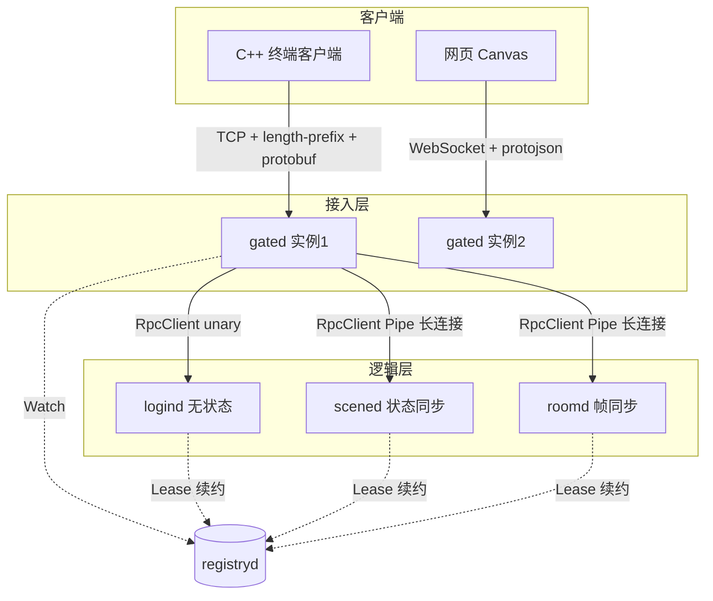
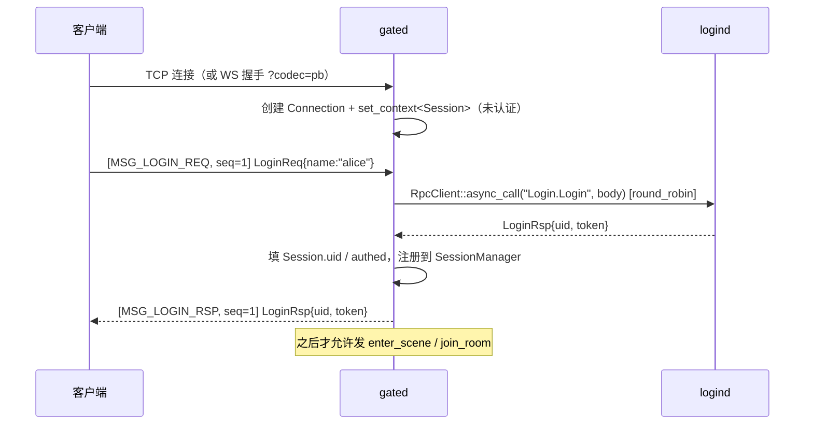

# C++ 分布式游戏服务器框架 —— 设计与分步实施指南

> 目标：在现有 `epoll_proj` 网络库之上，从零手写一个游戏服务器框架，把**帧同步**和**状态同步**
> 两种同步模型在同一套骨架上各实现一遍，并配一个简陋客户端验证「A 操作、B/C 可见」。
>
> 这份文档是实施地图，不是成品代码。每个阶段给出：要写什么、关键骨架、容易踩的坑、怎么验收。
> 代码请自己敲一遍 —— 帧同步的很多坑只有敲过才有体感。
>
> **本文是 Go 版设计稿的 C++ 重写版**（Go 原稿未纳入 git，已被本文覆盖，不再保留）。重写不是逐句翻译：
> Go 里「起个 goroutine + channel」的地方，在 C++ 里是「EventLoop 线程 + run_in_loop」；
> Go 里「go get 一个库」的地方，在 C++ 里往往是「自己写或者引一坨 CMake 依赖」。
> 凡是选型和纪律因语言而变的，都单独标了 **`[C++]`**。

Last updated: 2026-09-22

---

## 目录

0. [先核对家底：现在已经有什么](#0-先核对家底现在已经有什么)
1. [验收标准](#1-验收标准)
2. [前置知识：帧同步 vs 状态同步](#2-前置知识帧同步-vs-状态同步)
3. [整体架构](#3-整体架构)
4. [技术选型与依赖](#4-技术选型与依赖)
5. [目录结构](#5-目录结构)
6. [协议设计](#6-协议设计)
7. [`[C++]` 两条铁律：生命周期与线程归属](#7-c-两条铁律生命周期与线程归属)
8. [M0 网络库 + 日志 + RPC 骨架（已完成）](#m0-网络库--日志--rpc-骨架已完成)
9. [M1 基础设施与服务发现](#m1-基础设施与服务发现)
10. [M2 网关与登录](#m2-网关与登录)
11. [M3 状态同步场景](#m3-状态同步场景)
12. [M4 帧同步房间](#m4-帧同步房间)
13. [M5 玩家管理与战斗系统](#m5-玩家管理与战斗系统)
14. [M6 韧性与压测](#m6-韧性与压测)
15. [全局约束与踩坑清单](#15-全局约束与踩坑清单)
16. [附录 A：生产级游戏服务器全景图](#附录-a生产级游戏服务器全景图)
17. [附录 B：与现有 docs/ 路线的对齐表](#附录-b与现有-docs-路线的对齐表)

---

## 0. 先核对家底：现在已经有什么

Go 版设计稿假设从空目录开始。C++ 版不是 —— `epoll_proj` 已经把**传输层和事件层写完了**，
这一节的目的是让你（和后续会话）不要重复造已有的轮子。

### 0.1 已经能用的（2026-09-22 核对）

| 层 | 组件 | 状态 |
|---|---|---|
| util | `Buffer`（三段式）/ `LengthPrefixedCodec`（4B 大端长度 + payload）/ `MPSCQueue<T>`（有界，满则丢最新 + dropped 计数） | ✅ |
| 事件层 | `EventLoop`（epoll_wait + Channel 派发 + eventfd 唤醒 + pending_functors） | ✅ |
| 事件层 | `Channel`（fd 的 epoll 代言人，`tie()` 生命周期保护） | ✅ |
| 事件层 | `TimerQueue`（timerfd + `std::set`，`run_at` / `run_after` / `cancel_timer`，任意线程安全） | ✅ |
| 事件层 | 跨线程投递 `run_in_loop` / `queue_in_loop` | ✅ |
| 会话层 | `Connection`：双向 I/O、半阻塞 send + EPOLLOUT 回写、背压（HighWaterMark/WriteComplete，异步触发）、`shutdown()` 优雅半关、`force_close_with_delay(ms)`、`set_context<T>()` | ✅ |
| 会话层 | `TcpServer(port, num_threads)`：**主从 Reactor** —— mainLoop 只 accept，`EventLoopThreadPool` 起 N 个 subLoop round-robin 接管连接 | ✅ |
| 会话层 | `TcpClient`：非阻塞 connect + 指数退避重连（500ms → 30s 封顶） | ✅ |
| 应用层 | `log_server`（独立进程，按日+序号滚动落盘）+ `LogSender`（独立线程 + MPSCQueue + TcpClient）+ `LOG_DEBUG/INFO/WARN/ERROR` 宏 | ✅ |
| 应用层 | `http/`：HTTP/1.1 解析状态机 + HttpServer demo（验证了 `set_context<T>` 挂每连接状态机） | ✅ |
| 应用层 | `rpc/`：`RpcMessage` + `RpcCodec`（内层 15B 定长头）✅；`RpcServer`（方法注册表 + dispatch）✅ | ✅ |

**所以「多线程和客户端通信」这件事早就成立了**：`TcpServer(port, 4)` 起 4 个 IO 线程，
一条连接 accept 后被分给某个 subLoop，生命周期内不迁移，所有 I/O 在那条线程上做；
业务要跨线程碰它，走 `conn->loop()->run_in_loop(...)`。这正是下面 §3 里「场景 actor」要复用的机制。

### 0.2 还缺的（本文档要补的东西）

| 缺口 | 影响谁 | 在哪补 |
|---|---|---|
| `RpcClient`（pending 表 / 超时 / 断连收尾 / 同步 call） | 所有跨进程调用 | `RPC_NEXT_TASKS.md` RPC-3/4/5 |
| `EventLoop::run_every(interval, cb)` | 逻辑帧 tick | M3；或先用「`run_at(next_deadline)` 自递归」顶上（见 §M3.2） |
| protobuf 接入（CMake + 生成代码） | 协议层 | M2 |
| WebSocket（RFC6455 握手 + 帧） | 网页客户端 | M2（可选，先做原生 TCP 客户端也能跑通） |
| 服务注册与发现 | 多实例 | M1 |
| 会话管理 `uid ↔ Connection` | 网关 | M2 |
| 定点数 / AOI / 帧缓冲 / 确定性模拟 | 游戏逻辑 | M3 / M4 |
| 协程层（C++20） | 异步逻辑可写性 | `NEXT_TASKS.md` Task 8；非阻塞项，可后置 |

---

## 1. 验收标准

最终形态：

```bash
cmake -B build && cmake --build build -j

./build/registryd                 # 服务注册中心
./build/logind  --addr 127.0.0.1:9101
./build/scened  --addr 127.0.0.1:9201
./build/roomd   --addr 127.0.0.1:9301
./build/gated   --ws-port 8080

./build/gameclient --name alice   # 终端客户端 A
./build/gameclient --name bob     # 终端客户端 B
# 浏览器打开 http://127.0.0.1:8080 作为客户端 C
```

- A 在终端输入 `move 1 0`，B 的终端和 C 的网页上都能看到 A 在动。
- 同一个「移动」，`scene` 模式走服务端权威 + AOI 广播，`room` 模式走定帧输入转发 + 客户端确定性模拟。
- 杀掉一个 `scened` 实例，网关能自动摘除它，新玩家进到存活实例上。
- `[C++]` 全程 `-fsanitize=address` 和 `-fsanitize=thread` 各跑一遍压测，零报告。

> **`[C++]` 分阶段放宽**：上面是终态。**M3 之前完全不需要拆成 5 个进程** —— 见 §3.2，
> 前期把 gate / scene / room 做成同一进程里的 3 个 EventLoop 线程，接缝留好，M6 再拆。
> 一上来就 5 个二进制 + 服务发现，你会把时间全花在启动脚本和调试多进程上，而不是同步模型上。

---

## 2. 前置知识：帧同步 vs 状态同步

这是整个项目的学习核心，先把概念和取舍想清楚再动手，否则写到一半会把两者的职责混在一起。

### 2.1 状态同步（State Synchronization）

**服务端是唯一权威**。客户端只上报「意图」，服务端跑完整游戏逻辑，再把**结果状态**广播给客户端。

```
客户端                     服务端
  │  MoveReq{dir:(1,0)}      │
  ├─────────────────────────►│  记录输入意图
  │                          │  tick: pos += dir * speed * dt    ← 逻辑在服务端
  │  Snapshot{id, pos, hp}   │  tick: 算 AOI，给视野内玩家发快照
  │◄─────────────────────────┤
  │  插值平滑到目标位置        │
```

关键点：

- **逻辑帧与广播帧分离**。逻辑 tick 高（30Hz）保证手感，广播频率低（10Hz）省带宽。
- **AOI（Area of Interest）**：只把玩家视野内的实体发给他。不做 AOI 的话，1000 人同图 = 1000×1000 的广播量，必炸。
- **增量快照**：只发变化的字段 + 一个序号，客户端在上一个状态上打补丁。
- **客户端插值（interpolation）**：10Hz 的数据直接渲染会一卡一卡的，客户端要在两个快照之间插值，代价是画面比服务端真实状态**晚 1~2 个广播周期**。
- **客户端预测 + 服务端校正（prediction & reconciliation）**：本地玩家立刻按输入动起来（否则手感有 RTT 延迟），服务端快照回来后如果偏差过大就拉回。这是 FPS 的标准做法，本项目在 M5 作为进阶项。

优点：服务端权威所以**天生反外挂**（客户端改内存没用）；允许浮点、允许服务端有不确定行为；支持大世界、支持玩家随时进出。

缺点：服务端 CPU 和带宽开销大（带宽 ≈ 视野内实体数 × 广播频率 × 每实体字节数）；必须写插值/预测才不卡。

适用：MMORPG、FPS、开放世界、SLG。

### 2.2 帧同步（Lockstep / Frame Synchronization）

**服务端不跑游戏逻辑**，只做「输入收集器 + 定时广播器」。所有客户端跑**完全相同**的逻辑代码，输入相同 ⇒ 结果必然相同。

```
客户端 A          服务端（房间）           客户端 B
  │ Input{f:100}     │                         │
  ├─────────────────►│  收进第 100 帧的桶       │
  │                  │◄────────────────────────┤ Input{f:100}
  │                  │  50ms 到点：打包并广播
  │ Frame{100,[a,b]} │  Frame{100,[a,b]}       │
  │◄─────────────────┼────────────────────────►│
  │ 用相同逻辑推进第100帧                        │ 用相同逻辑推进第100帧
  │ ⇒ 两端状态必须逐位相同                        │
```

关键点：

- **帧率固定**（本项目 50ms / 20fps 逻辑帧）。客户端的逻辑时钟**由服务端的帧驱动**，不是由本地时钟驱动。
- **空帧也必须发**。这一帧没人输入也要发一个 `Frame{id, inputs:[]}`，否则客户端逻辑时钟停摆。这是新手最常犯的错。
- **确定性是硬约束**。任何一条违反，两端就会算出不同结果（desync），而且往往是几分钟后才肉眼可见。
  **`[C++]` 的雷区和 Go 完全不是同一批**，单独列在 §2.4，务必读。
- **延迟处理**。严格 lockstep 要等最慢的人，体验极差。实用做法是**乐观帧（optimistic lockstep）**：服务端到点就发，没收到输入的玩家这一帧视为「无输入」或沿用上一帧输入；客户端本地维护一个小的帧缓冲区（2~3 帧）吸收抖动。
- **追帧（catch-up）**：断线重连后从第 N 帧拉全部历史帧，客户端在一个渲染帧里快速跑完几百个逻辑帧追上进度。
- **录像回放（replay）**：只要存下输入帧序列 + 初始种子，就能完整复现整场战斗。这是帧同步最爽的副产品，几乎零成本。
- **desync 检测**：客户端每 N 帧把关键状态算个 hash 上报，服务端比对，不一致就报警。做了这个，排查确定性问题从「玄学」变成「可定位到第几帧」。

优点：**流量极小**且与实体数无关（只传输入，1000 个单位和 10 个单位流量一样）；服务端 CPU 几乎为零，一台机器能开很多房；回放/观战几乎免费。

缺点：一致性脆弱，一个浮点就全盘崩；客户端持有全图信息，**天然难反外挂**（视野挂/全图挂无解）；断线重连要追帧；不支持玩家随意中途加入。

适用：RTS、MOBA、格斗、卡牌、自走棋。

### 2.3 对比表

| 维度      | 状态同步            | 帧同步             |
| ------- | --------------- | --------------- |
| 逻辑跑在哪   | 服务端             | 所有客户端           |
| 服务端职责   | 完整模拟 + AOI + 快照 | 收输入 + 定帧转发      |
| 网络流量    | O(视野实体数 × 广播频率) | O(输入数)，与实体数无关   |
| 服务端 CPU | 高               | 极低              |
| 浮点数     | 可以用             | 禁止，必须定点数        |
| 反外挂     | 强（服务端权威）        | 弱（客户端有全图信息）     |
| 中途加入    | 天然支持            | 需要状态快照或追帧       |
| 录像回放    | 需额外记录状态流        | 存输入序列即可，几乎免费    |
| 断线重连    | 拉一份全量快照         | 追帧，重放历史输入       |
| 主要风险    | 带宽、服务端性能        | 确定性（desync）     |
| 典型品类    | MMO / FPS / SLG | MOBA / RTS / 格斗 |

一句话记忆：**状态同步同步「结果」，帧同步同步「原因」。**

### 2.4 `[C++]` 确定性雷区清单（帧同步路径专用）

Go 版原稿列的是「map 遍历随机、`time.Now()`、`rand`」。C++ 的坑**更隐蔽**，因为 C++ 里很多东西
「在你这台机器上跑起来是确定的」，但换个编译器版本 / 标准库 / 优化等级就变了。
下面每一条都会导致 desync，且都**不会报错**。

| # | 雷 | 为什么危险 | 处理 |
|---|---|---|---|
| 1 | **浮点** | x86-64 用 SSE 还算规矩，但 `-ffast-math` 会重排运算、`-ffp-contract=fast`（GCC 默认！）会把 `a*b+c` 合成 FMA 改变舍入、32 位 x87 是 80-bit 中间精度 | 逻辑层**全定点数**（§M4.1）。编译单元加 `-ffp-contract=off`，禁用 `-ffast-math` |
| 2 | **`std::unordered_map` / `unordered_set` 遍历顺序** | 标准**不保证**顺序；实际顺序取决于 bucket 数、hash 实现、插入历史。libstdc++ 和 libc++ 结果不同，甚至同一 libstdc++ 换版本也可能不同 | 逻辑层**禁止遍历无序容器**。用 `std::vector` + 稳定 ID 排序，或 `std::map`（红黑树，按 key 有序） |
| 3 | **`std::sort` 不稳定** | 相等元素的相对顺序未定义，且不同实现的排序算法不同 | 用 `std::stable_sort`，或让比较器构成**全序**（比较到唯一 ID 为止） |
| 4 | **`std::uniform_int_distribution` 等分布** | 引擎（`mt19937`）跨实现一致，但**分布对象不一致** —— libstdc++ 和 libc++ 同种子同引擎产出不同数列 | 自己写 PRNG + 自己写取模（§M4.1 `DetRandom`） |
| 5 | **`std::hash`** | 不保证跨实现/跨版本/跨进程稳定（有的实现还加随机种子） | state hash 自己写 FNV-1a / CRC32，别用 `std::hash` |
| 6 | **指针 / 迭代器地址参与逻辑** | 地址每次运行都不同（ASLR），拿它排序或当 key 就完了 | 一律用稳定的 `EntityId` |
| 7 | **整数除法向零截断** | `-1 / 10 == 0`，`-1 % 10 == -1`。AOI 网格算 cell 时负坐标会把 `[-9,-1]` 和 `[0,9]` 归进同一格 | 写 `floor_div` / `floor_mod` 辅助函数（§M3.4） |
| 8 | **有符号右移** | C++20 起才**保证**算术右移（补符号位）；定点数的 `>> 16` 依赖它 | 工程已是 `-std=c++20`，放心用；但别在别处退回 C++17 |
| 9 | **有符号溢出是 UB** | 编译器会基于「不会溢出」做激进优化，行为不可预测 | 中间结果用 `__int128`（§M4.1），或显式用无符号运算再转回 |
| 10 | **未初始化变量** | 读它是 UB，值随栈内容变 | 成员一律类内初始化；`-Wuninitialized`、ASan、`-ftrivial-auto-var-init=pattern` |
| 11 | **多线程执行顺序** | 逻辑分到两条线程上跑，顺序不定 | 逻辑层**单 EventLoop 线程**（§3.3），这也是本项目的架构基础 |
| 12 | **`std::chrono::steady_clock::now()`** | 逻辑里读真实时间 = 直接不确定 | 逻辑层禁用。逻辑时钟 = 帧号 × 帧长 |

> **建议做一个 CI 检查脚本**：对 `sim/` 目录 grep 这批符号（`float`、`double`、`unordered_`、
> `std::sort`、`rand`、`now()`、`std::hash`），命中就 fail。Go 版原稿建议过，C++ 里更有必要，
> 因为 `double` 会从任何一个不小心 include 的头文件里渗进来。

---

## 3. 整体架构

### 3.1 终态拓扑



| 服务          | 有状态?  | 职责                                       |
| ----------- | ----- | ---------------------------------------- |
| `registryd` | 有（注册表） | 服务注册中心。`[C++]` **自己写**（见 M1），不嵌 etcd |
| `gated`     | 有（连接） | 唯一对外暴露的服务。管连接、会话、编解码、把消息路由到后端 |
| `logind`    | 无     | 账号校验、签发 token。无状态所以可以任意水平扩容、轮询调用         |
| `scened`    | 有（场景） | 状态同步世界。每个场景是一个 actor                     |
| `roomd`     | 有（房间） | 帧同步房间。每个房间是一个 actor                      |

**网关的意义**：把「连接管理」和「游戏逻辑」解耦。后端服务重启时连接不断；后端不需要关心 WebSocket、心跳、编解码；客户端只连一个地址。

### 3.2 `[C++]` 关键设计决定零：先单进程多线程，后拆进程

这是 C++ 版相对 Go 版**最大的路线改动**，理由很实在：

- Go 起一个新进程的成本是 `go run ./cmd/xxx`；C++ 是「加 CMake target + 写 main + 写启动脚本 + 调试多进程」。
- Go 有 `grpc.NewClient` 开箱即用；C++ 这边**你的 RpcClient 还没写完**（RPC-3/4/5 是当前断点）。
- 同步模型的学习价值 100% 在 scene/room 的逻辑里，0% 在进程边界上。

所以：

```
阶段一（M2~M4）：单进程 gameserver
  ┌──────────────────────────────────────────────────┐
  │ mainLoop 线程     : TcpServer accept              │
  │ io subLoop × N    : 客户端连接的读写（现成能力）    │
  │ scene 线程        : 一个 EventLoop = 一个场景 actor │
  │ room  线程        : 一个 EventLoop = 一个房间 actor │
  │ logSender 线程    : 已有                           │
  └──────────────────────────────────────────────────┘
  跨线程通信 = loop->run_in_loop(lambda)   ← 零序列化、零网络

阶段二（M6）：拆成 gated / scened / roomd
  跨进程通信 = RpcClient Pipe（序列化 + 网络）
```

**接缝在哪**：业务代码只能通过一个抽象发消息，绝不直接拿别的 actor 的指针：

```cpp
// game/actor_ref.h —— 唯一允许的「给别的 actor 发消息」的方式
class ActorRef {
public:
    virtual ~ActorRef() = default;
    // 投递一条消息。非阻塞，不保证送达（对端过载会丢并计数）。
    virtual void post(uint32_t msg_id, std::string body) = 0;
};

// 阶段一实现：目标 actor 在本进程，直接 run_in_loop
class LocalActorRef : public ActorRef {
    EventLoop* target_loop_;
    std::weak_ptr<Actor> target_;     // weak：目标 actor 可能已销毁
    void post(uint32_t msg_id, std::string body) override {
        target_loop_->queue_in_loop(
            [w = target_, msg_id, b = std::move(body)]() mutable {
                if (auto a = w.lock()) a->on_message(msg_id, std::move(b));
            });
    }
};

// 阶段二实现：目标 actor 在别的进程，走 RPC Pipe
class RemoteActorRef : public ActorRef {
    RpcClient* pipe_;
    void post(uint32_t msg_id, std::string body) override {
        pipe_->push(msg_id, std::move(body));   // 见 §6.3
    }
};
```

写业务时只认 `ActorRef`，M6 拆进程就是换一个实现类 + 加序列化，**场景和房间的逻辑一行不动**。

### 3.3 `[C++]` 关键设计决定一：EventLoop 就是 actor，不要再造一套

Go 版里 actor = `goroutine + mailbox channel + ticker`：

```go
for {
    select {
    case msg := <-mailbox: s.handle(msg)
    case <-ticker.C:       s.tick()
    case <-ctx.Done():     return
    }
}
```

`[C++]` **这三样你已经全有了，就在 `EventLoop` 里**，一一对应：

| Go actor 要素 | epoll_proj 里的对应物 |
|---|---|
| goroutine | `EventLoopThread` 起的线程（`start_loop()` 返回 `EventLoop*`） |
| mailbox channel | `pending_functors_` + `run_in_loop` / `queue_in_loop`（eventfd 唤醒） |
| `ticker.C` | `TimerQueue`（`run_after` / `run_at`，timerfd 驱动） |
| `ctx.Done()` | `EventLoop::quit()`（atomic + wakeup，任意线程可调） |
| `select` 多路等待 | `epoll_wait` 本身 —— 而且它还能顺带等**网络 fd**，Go 的 select 做不到 |

所以场景 actor 长这样，**没有一行新的并发原语**：

```cpp
// game/scene/world.h
class World : public std::enable_shared_from_this<World> {
public:
    World(EventLoop* loop, SceneId id) : loop_(loop), id_(id) {}

    void start() {                       // 必须在 loop_ 线程调
        loop_->assert_in_loop_thread();
        next_tick_ = std::chrono::steady_clock::now();
        schedule_next_tick();
    }

    // 外部（任意线程）投递消息的唯一入口
    void post(Msg msg) {
        loop_->queue_in_loop([w = weak_from_this(), m = std::move(msg)]() mutable {
            if (auto self = w.lock()) self->handle(std::move(m));
        });
    }

private:
    void handle(Msg msg);                // 只在 loop_ 线程跑
    void on_tick();                      // 只在 loop_ 线程跑
    void schedule_next_tick();

    EventLoop* loop_;
    SceneId    id_;
    // 以下全部裸成员，无 mutex、无 atomic —— 线程归属保证了安全
    std::vector<Entity> entities_;
    Grid                aoi_;
    uint64_t            tick_seq_ = 0;
    std::chrono::steady_clock::time_point next_tick_;
};
```

**为什么不用锁 + 多线程？** 因为游戏逻辑是**高度耦合**的状态图（A 打 B，B 的死亡触发 C 的仇恨，
C 又影响 A），加锁必然死锁或者退化成一把大锁。单线程 actor 是行业标准答案。

代价：单个场景的吞吐受单核限制 ⇒ 靠**多开场景/房间实例**横向扩展，而不是靠场景内并行。

> **`[C++]` 已知缺口**：`pending_functors_` 是无界 `std::vector` —— Go 的 `Post` 能靠
> `select + default` 做「满了就丢」，你现在做不到。如果某个 actor 卡住，投递方会一直堆内存而不是快速失败。
> M6 压测前给 `EventLoop` 加一个 `pending_functors_.size()` 的水位告警，或在 `ActorRef::post`
> 里自己套一层 `MPSCQueue`（有界 + dropped 计数，现成的）做背压 —— **推荐后者**，因为它不动 `src/`。

### 3.4 关键设计决定二：上下行共用一条长连接（Pipe）

游戏服务器和普通 Web 后端最大的区别是**服务端要主动推送**。请求-响应的 unary RPC 解决不了「服务端广播给 20 个玩家」。

常见方案有三种：后端反向连接网关（网关要开 server，拓扑复杂）、走消息队列（引入外部中间件）、**网关主动建长连接**。本项目选第三种：

```
gated 发现一个 scened 实例
  └─► TcpClient 连过去，长期保持
        ├─ 上行：客户端消息（带 uid）往上推
        └─ 下行：服务端广播（带 target_uids 列表）往下走
```

一个网关对一个后端实例只需**一条**连接，所有玩家的消息在这条连接上按 uid 多路复用。

`[C++]` 落地方式：**扩展现有的 `RpcMessage`，加一个 `kPush` 类型**（见 §6.3）。
Go 版靠 gRPC 的 `stream` 关键字自动生成双向流，你没有代码生成器，所以自己在协议里开一个「不需要响应、不占 request_id」的消息类型，效果一样而且更简单。

### 3.5 关键设计决定三：会话亲和性（session affinity）

`logind` 无状态，随便轮询哪个实例都行。但 `scened` / `roomd` 是**有状态**的 —— 玩家的场景对象只存在于某一个特定实例的内存里，后续消息必须**打到同一个实例**。

做法：玩家进场景时由网关选一个实例，把 `uid → instance_id` 记在网关的 session 上，之后所有 `scene.*` 消息都走这个实例的连接。

```cpp
// gate/session.h
struct Session {
    uint64_t      uid = 0;
    ConnectionPtr conn;             // 客户端连接
    std::string   scene_instance;   // 绑定的 scened 实例 ID，空 = 未进场景
    std::string   room_instance;    // 绑定的 roomd 实例 ID
    int64_t       last_active_ms = 0;
    bool          authed = false;
};
```

`[C++]` 挂载方式：`conn->set_context<Session>(std::make_shared<Session>())`，
取用 `conn->context<Session>()`。这套机制 `http/` 里挂解析器状态机已经验证过了。

> 这里就是分布式游戏服最本质的难点：**有状态服务的路由**。想清楚了，后面的跨服、迁移、热更都是这个问题的变体。

---
## 4. 技术选型与依赖

### 4.1 `[C++]` 选型总表

Go 版的选型是「`go get` 一行」。C++ 这边每引一个依赖都要过 CMake，所以原则是
**能自己写的（且属于学习目标的）就自己写，不属于学习目标的才引库**。

| 需求 | Go 版方案 | `[C++]` 方案 | 决策理由 |
|---|---|---|---|
| 网络 I/O | `net` + goroutine | **现有 `epoll_proj`** | 已完成，本项目的地基 |
| 服务间 RPC | gRPC | **自己的 `rpc/`** | 学习目标本身；gRPC C++ 依赖极重（protobuf+absl+re2+c-ares+openssl） |
| 序列化 | protobuf-go | **protobuf（C++）** | 唯一强烈推荐引入的外部依赖，见 §4.2 |
| 服务发现 | embed etcd | **自己写 `registryd`** | etcd 无官方 C++ 客户端；`etcd-cpp-apiv3` 要拖进整个 gRPC。自己写 = 复用你的 RPC，且租约/Watch 正是要学的东西 |
| WebSocket | gorilla/websocket | **自己写**（复用 `http/` 的解析 + SHA1/Base64） | 握手 + 帧格式合计约 300 行，属于学习目标 |
| 日志 | `log/slog` | **现有 `LOG_*` + log_server** | 已完成，比 Go 版起点还高 |
| 配置 | `gopkg.in/yaml.v3` | **自己写 KV 解析** 或 `nlohmann/json`（header-only） | 别为了读配置引 yaml-cpp；JSON 单头文件更省事 |
| 单元测试 | `testify` | **现有风格：自包含可执行 + 返回码即结论** | 与 `test_logging` / `test_rpc_codec` 一致，不引 gtest |
| 数据竞争检测 | `go test -race` | `-fsanitize=thread`（已有 `test_mpsc_queue_tsan` 先例） | |
| 内存错误 | GC | `-fsanitize=address,undefined` | Go 版不需要这一行，C++ 版是刚需 |
| Redis（M5） | `go-redis` | `redis-plus-plus`（基于 hiredis） | 需要时再引 |
| MongoDB（M5） | `mongo-driver` | `mongocxx`（已在 `NEXT_TASKS.md` Task 12 规划） | 需要时再引 |
| 定点数 / AOI / 时间轮 | 自己写 | 自己写 | 学习目标 |

### 4.2 protobuf 接入（唯一必需的新依赖）

```bash
# Debian/Ubuntu
sudo apt install protobuf-compiler libprotobuf-dev
# 或源码装，确认 protoc --version 与 libprotobuf 版本一致（版本错位是最常见的坑）
```

```cmake
find_package(Protobuf REQUIRED)

# 生成 C++ 代码。CMake >= 3.13 推荐用 protobuf_generate（比老的 PROTOBUF_GENERATE_CPP 好用）
add_library(game_proto OBJECT
    proto/common.proto proto/client.proto
    proto/login.proto  proto/scene.proto  proto/room.proto)
target_link_libraries(game_proto PUBLIC protobuf::libprotobuf)
target_include_directories(game_proto PUBLIC ${CMAKE_CURRENT_BINARY_DIR})
protobuf_generate(TARGET game_proto LANGUAGE cpp)
```

**`[C++]` 三个必踩的坑**：

1. **`protoc` 与 `libprotobuf` 版本必须匹配**。生成的 `.pb.cc` 里有版本断言，不匹配时链接期或运行期直接爆。
2. **生成文件放 build 目录**，不要提交进 git，但 `target_include_directories` 要把 `${CMAKE_CURRENT_BINARY_DIR}` 加进去，否则 `#include "xxx.pb.h"` 找不到。
3. **protobuf 3.22+ 依赖 Abseil**，`find_package(Protobuf)` 可能要你先 `find_package(absl)`。如果系统包版本太新踩到这个，退回用 `pkg_check_modules(PROTOBUF protobuf)`。

**JSON 互通（给网页客户端）**：Go 有 `protojson`，C++ 的对应物在 protobuf 自带的
`google/protobuf/util/json_util.h`：

```cpp
#include <google/protobuf/util/json_util.h>

std::string json;
google::protobuf::util::MessageToJsonString(msg, &json);          // 默认 lowerCamelCase
google::protobuf::util::JsonStringToMessage(json, &msg);
```

> 默认输出 **lowerCamelCase**（`enter_scene` → `enterScene`），网页客户端按这个写 JS 对象。
> 也可以设 `JsonPrintOptions::preserve_proto_field_names = true` 保持下划线风格，**二选一但别混用**。

### 4.3 关于服务发现的选型

| 方案 | 机制 | `[C++]` 可用性 |
| --- | --- | --- |
| **自己写 `registryd`**（本项目选择） | 复用自己的 RPC；Lease 续约做存活检测，长连接推送做 Watch | 零新依赖，且是学习目标 |
| etcd v3 | Lease + Watch | 无官方 C++ 客户端；`etcd-cpp-apiv3` 要整个 gRPC 栈，不划算 |
| Consul | Agent 健康检查 + HTTP API | **`[C++]` 次优解**：HTTP + JSON 接口，你已经有 HTTP 解析器，接起来不难；代价是要单独跑 agent |
| ZooKeeper | 临时节点 + Watch | 有 C 客户端（`zookeeper_mt`），但 API 老旧难用 |
| Redis | `SET key val EX 10` 续约 + keyspace notification | 如果 M5 已经引了 redis，可以顺手当注册中心用（生产不推荐，学习够了） |

`go-micro` / `kratos` 这类框架在 C++ 里没有对等物（brpc / bRPC 算最接近的），
而且**它们正好把你想亲手写的那一层挡住了**。所以本项目自己定义 `Registry` 接口，自己写 `registryd`。

---

## 5. 目录结构

在现有 `epoll_proj` 上**增量扩展**，不推倒重来。已有的标 `✅`：

```
epoll_proj/
├── CMakeLists.txt
├── src/                          ✅ 网络库：EventLoop / Channel / Connection / TcpServer / TcpClient / TimerQueue
├── util/                         ✅ Buffer / LengthPrefixedCodec / MPSCQueue
├── log_sender/  log_server/      ✅ 日志链路
├── http/                         ✅ HTTP/1.1 解析 + HttpServer（WebSocket 握手复用它）
├── rpc/                          ✅ rpc_message.h / rpc_server —— 待补 rpc_client
│   ├── rpc_message.h             ✅ RpcMessage + RpcCodec（内层 15B 头）
│   ├── rpc_server.{h,cpp}        ✅
│   ├── rpc_client.{h,cpp}        ⬜ RPC-3/4/5
│   └── registry/                 ⬜ M1：Registry 接口 + 实现
│       ├── registry.h            ⬜ Instance / Registry / Watcher 接口
│       ├── static_registry.{h,cpp}  ⬜ 配置文件直连（最先能用）
│       ├── client_registry.{h,cpp}  ⬜ 连 registryd 的客户端
│       └── registryd_main.cpp    ⬜ 注册中心进程
├── proto/                        ⬜ M2：协议定义（protobuf）
│   ├── common.proto  client.proto
│   ├── login.proto   scene.proto   room.proto
│   └── server.proto              # 网关 ↔ 后端的 Pipe 消息
├── net_app/                      ⬜ M2：net 之上、game 之下的通用应用层
│   ├── message_codec.{h,cpp}     # msgid(u32) + protobuf body，套在 LengthPrefixedCodec 内层
│   ├── dispatcher.{h,cpp}        # msgid → handler 路由表
│   ├── ws_handshake.{h,cpp}      # WebSocket 升级握手（复用 http/ 解析）
│   └── ws_frame.{h,cpp}          # RFC6455 帧编解码（掩码 / 分片 / 控制帧）
├── gate/                         ⬜ M2：网关
│   ├── session.{h,cpp}           # Session + SessionManager（uid ↔ conn 双向索引）
│   ├── router.{h,cpp}            # 客户端消息按 msgid 路由到后端
│   └── upstream.{h,cpp}          # 后端实例连接池 + Pipe 管理 + 重连
├── game/                         ⬜ M3+：游戏逻辑
│   ├── actor.{h,cpp}             # Actor 基类（EventLoop + mailbox + tick）
│   ├── actor_ref.h               # Local/Remote 两种投递实现（§3.2 的接缝）
│   ├── fixed.h                   # Q16.16 定点数（M4）
│   ├── det_random.h              # 确定性伪随机（M4）
│   ├── scene/                    # 状态同步：entity / aoi / world / snapshot
│   ├── room/                     # 帧同步：room / framebuffer / replay / matcher
│   ├── sim/                      # ★ 确定性模拟逻辑（服务端和客户端共用同一份源码）
│   ├── battle/                   # 战斗系统（M5），被 scene 和 room 共用
│   └── player/                   # 玩家数据 Store 接口 + 内存/Mongo 实现（M5）
├── cmd/                          ⬜ 各可执行的 main（只做装配，不写逻辑）
│   ├── gameserver_main.cpp       # 阶段一：单进程全家桶
│   ├── gated_main.cpp  logind_main.cpp  scened_main.cpp  roomd_main.cpp   # 阶段二
│   ├── gameclient_main.cpp       # C++ 终端客户端
│   └── bot_main.cpp              # 压测机器人（M6）
├── web/
│   └── index.html                ⬜ 单页 Canvas 客户端（不用打包工具）
└── docs/                         ✅ 已有一批，见附录 B
```

**划分原则**（沿用现有工程的 `rpc/ → src/ → util/` 依赖方向）：

```
cmd/ → gate/ | game/ → net_app/ → rpc/ → src/ → util/
                         proto/ ──┘
```

**依赖方向只能单向**，反向依赖一律禁止。特别地：**任何新代码都不许塞回 `src/`** ——
`src/` 是与游戏无关的通用网络库，唯一允许的改动是 M3 要加的 `EventLoop::run_every`。

---

## 6. 协议设计

这里有**三层**要分清楚，Go 版因为有 gRPC 帮忙藏了一层，C++ 版必须自己摆明白：

```
┌─ 第 1 层：帧边界 ──────────────────────────────────────────┐
│  LengthPrefixedCodec：4B 大端 length + payload    ✅ 现成    │
├─ 第 2 层：路由头 ──────────────────────────────────────────┤
│  客户端↔网关 ：msgid(u32) + protobuf body                   │
│  网关↔后端   ：RpcMessage（type/request_id/status/method）   │
├─ 第 3 层：业务载荷 ────────────────────────────────────────┤
│  protobuf message（LoginReq / SceneSnapshot / FrameCmd ...） │
└────────────────────────────────────────────────────────────┘
```

### 6.1 客户端协议：`[C++]` 用 msgid，不用 oneof 大信封

Go 版选了「一个大 `oneof` 信封」，理由是 Go 侧 `switch` 分支类型安全。
**`[C++]` 建议改成 `msgid(uint32) + body`**，理由：

- C++ 的 protobuf oneof 访问是 `msg.body_case()` + `msg.enter_scene()`，写出来是一坨 switch + 手动取字段，
  远不如 Go 的类型 switch 优雅，**oneof 的主要优势在 C++ 里消失了**。
- msgid 路由天然对应你已经规划的 `net_app/dispatcher`（`NEXT_TASKS.md` Task 9），
  handler 注册表和 `RpcServer::register_method` 是同一个模式，一套心智。
- 加一个消息不用改信封文件，不用全量重编译 proto。

代价：msgid 和 message 类型的对应关系要手工维护，且 body 是 `bytes`，网页调试时看不到内容。
后者用「**JSON 模式下额外带一个 `msg_name` 字段**」补偿（见 §6.2）。

```protobuf
// proto/client.proto
syntax = "proto3";
package client.v1;

// msgid 编号规则：模块号 × 1000 + 序号；请求偶数、响应/推送奇数，肉眼可辨
enum MsgId {
  MSG_UNKNOWN          = 0;

  MSG_PING             = 1000;   MSG_PONG              = 1001;
  MSG_LOGIN_REQ        = 1002;   MSG_LOGIN_RSP         = 1003;

  MSG_ENTER_SCENE_REQ  = 2000;   MSG_ENTER_SCENE_RSP   = 2001;
  MSG_SCENE_MOVE_REQ   = 2002;
  MSG_LEAVE_SCENE_REQ  = 2004;
  MSG_SCENE_SNAPSHOT   = 2005;   // 服务端主动推送
  MSG_AOI_EVENT        = 2007;   // 实体进入/离开视野

  MSG_JOIN_ROOM_REQ    = 3000;   MSG_JOIN_ROOM_RSP     = 3001;
  MSG_ROOM_INPUT_REQ   = 3002;
  MSG_FRAME_CMD        = 3003;   // 帧同步下行：一帧的全部输入（主动推送）
  MSG_FRAME_HASH_REQ   = 3004;   // desync 检测：客户端上报状态 hash
  MSG_CATCH_UP_REQ     = 3006;   MSG_CATCH_UP_RSP      = 3007;
  MSG_ROOM_OVER_NTF    = 3009;
}
```

帧内布局：

```
+----------------+---------------------------------------------+
|  4B length(BE) |  msgid(4B BE) | seq(4B BE) | protobuf body   |
+----------------+---------------------------------------------+
   LengthPrefixedCodec ✅            net_app/message_codec ⬜
```

- `seq`：客户端请求序号，服务端在响应里原样回填，用于对齐请求和响应。**服务端主动推送时 `seq = 0`。**
  （这和 RPC 层的 `request_id` 是同一个思路的两个实例，别混用同一个字段。）
- 错误码不进这一层的头，放各自的 `XxxRsp` 消息里（`int32 code` + `string msg`），
  因为只有响应才需要它，塞进公共头是浪费。

> **协议版本约定**：protobuf 字段编号一旦发布就不能改，删字段用 `reserved`。
> msgid 同理，**只增不改，废弃的号不复用**。这个习惯从第一天养成，否则后面客户端/服务端版本一错位就是通宵。

### 6.2 编码协商

握手时区分（WebSocket 用 URL query，原生 TCP 用第一个包的 magic）：

- C++ 终端客户端：`?codec=pb` → 二进制 + `SerializeToString`
- 网页：`?codec=json` → 文本帧 + `MessageToJsonString`

`[C++]` JSON 模式下 body 是 `bytes` 会变成 base64，网页没法读。解决办法：
**JSON 模式不用二进制头，整个帧就是一个 JSON 对象**：

```json
{ "msg": "SceneSnapshot", "seq": 0, "body": { "seq": 42, "deltas": [...] } }
```

服务端维护一张 `msgid ↔ 消息名` 表（可以用 protobuf 的 descriptor 自动生成：
`Msg::descriptor()->full_name()`），JSON 模式下走名字，PB 模式下走 msgid。
**编解码收敛在 `net_app/message_codec` 里，业务代码完全不感知走的是哪种。**

### 6.3 服务间协议：`[C++]` 扩 `RpcMessage`，加 `kPush`

Go 版用 gRPC 的 `stream` 关键字做双向流。C++ 版没有代码生成器，
**直接在你已经写好的 `rpc/rpc_message.h` 上加第三种消息类型**：

```cpp
// rpc/rpc_message.h（在现有基础上扩展）
enum class RpcType : uint8_t {
    kRequest  = 0,
    kResponse = 1,
    kPush     = 2,   // 新增：单向推送，不需要响应
};
```

`kPush` 的字段约定：

- `request_id = 0`（不占 pending 表，不等响应）
- `method` 复用为推送的消息名，如 `"Scene.Push"`
- `status` 恒为 `kOk`
- `body` = 序列化后的 `SceneToGate`

**兼容性检查**：现有 `RpcCodec::decode` 有一行 `type > kResponse → 返回 false`，
加 `kPush` 时**记得把这个上界改成 `kPush`**，否则新消息会被当非法帧丢弃并关连接。
`RpcServer::on_message` 里「收到非 Request 就 `conn->close()`」的分支同理。

Pipe 上跑的两个方向：

```protobuf
// proto/server.proto
message GateToScene {
  string gate_id = 1;               // 网关实例 ID，服务端记录玩家归属
  uint32 sub_msg = 2;               // 子消息类型：enter / leave / request
  uint64 uid     = 3;
  bytes  payload = 4;               // 原样透传的 client.v1 消息帧
}

message SceneToGate {
  repeated uint64 target_uids = 1;  // 精确投递；为空 = 广播给该网关上本服务的所有玩家
  uint32 msg_id  = 2;
  bytes  body    = 3;
}
```

`roomd` 的 Pipe 结构完全一样。`logind` 是无状态的请求-响应，用普通 `RpcClient::call` 就行。

---

## 7. `[C++]` 两条铁律：生命周期与线程归属

这一整节是 Go 版**完全没有**的内容。Go 有 GC，对象只要还被引用就活着；C++ 里
「回调跑到一半对象没了」是这类框架最高频的崩溃来源。工程里 `.claude/rules/net.md` 已经定过规矩，
这里把它在游戏逻辑场景下的具体形态写清楚。

### 7.1 铁律一：异步路径必须持有所有权凭证

| 场景 | 怎么捕获 | 为什么 |
|---|---|---|
| 回调里要用 `Connection` | 捕获 **`ConnectionPtr`（shared_ptr）副本** | 延寿到回调执行完。`Connection` 已 `enable_shared_from_this` |
| 定时器回调里要用 `Connection` | 捕获 **`std::weak_ptr<Connection>`**，用时 `lock()` | 定时器可能比连接活得久，shared 会让死连接赖着不走。`force_close_with_delay` 就是这么写的 |
| actor 给自己投递任务 | 捕获 **`weak_from_this()`** | actor 可能在任务执行前被销毁（场景关闭） |
| 跨 actor 投递消息 | **只传值**（uid、坐标、序列化后的 body） | 绝不传另一个 actor 内部对象的指针/引用 —— 那等于绕过线程归属 |
| lambda 捕获 `this` | 只在「`this` 的生命周期严格覆盖 loop」时允许（如 `TcpServer` 成员） | 其余一律用 weak |

```cpp
// ✅ 正确：定时器用 weak，避免延长寿命
auto weak = std::weak_ptr<Connection>(conn);
loop->run_after(10'000, [weak] {
    if (auto c = weak.lock()) c->shutdown();
});

// ❌ 错误：定时器持 shared，连接断了也要等 10 秒才释放；若定时器不断重挂则永不释放
loop->run_after(10'000, [conn] { conn->shutdown(); });
```

### 7.2 铁律二：数据只属于一条线程，跨线程一律投递

```cpp
// ❌ 错误：从 IO 线程直接改场景数据
void on_client_message(const ConnectionPtr& conn, Buffer& buf) {
    world_->entities_[uid].pos = pos;      // 数据竞争，TSan 会抓，但更可能是静默错乱
}

// ✅ 正确：投递给场景 actor 的线程
void on_client_message(const ConnectionPtr& conn, Buffer& buf) {
    world_->post(MoveMsg{uid, dx, dy});    // 内部 queue_in_loop，值传递
}
```

**判据**：如果你想给一个成员变量加 `std::mutex` 或 `std::atomic`，先停下来问
「它是不是属于某个 loop 线程？」。90% 的情况答案是「是」，那就不该加锁，该改成投递。
剩下 10%（比如全局指标计数器、`LogSender` 的 `MPSCQueue`）才是真正需要同步原语的地方。

### 7.3 关闭顺序：C++ 里最容易出事的地方

Go 版的 `ctx.Done()` 一发，所有 goroutine 自己退，GC 收尾。C++ 需要**显式的逆序拆除**：

```
关闭一个场景 actor：
  1. 停止接受新消息           （标志位，在 loop 线程置）
  2. cancel 所有定时器        （tick timer、buff 到期 timer）
  3. 通知所有玩家「场景关闭」  （最后一次广播）
  4. 存盘（M5）
  5. loop_->quit()
  6. **在 loop 线程内**释放 actor 持有的、要求 in-loop 析构的资源
  7. join 线程
  8. 主线程才能析构 actor 对象本身
```

第 6 步是 C++ 特有的陷阱，而且**你已经踩过一次**：`~TcpClient` 第一行就是
`assert_in_loop_thread()`，`LogSender` 当初在 main 线程析构直接触发致命错误，
最后是在 `stop_in_loop` 里 `tcp_client_.reset()` 才修好。
**任何持有 `TcpClient` 的 actor（网关的 upstream 连接池就是）都会重演这个坑**，提前记住。

### 7.4 调试工具

```bash
# 数据竞争（对应 go test -race）
cmake -B build-tsan -DCMAKE_CXX_FLAGS="-fsanitize=thread -O1 -g"
# 内存错误 + UB（Go 不需要，C++ 必需）
cmake -B build-asan -DCMAKE_CXX_FLAGS="-fsanitize=address,undefined -fno-omit-frame-pointer -O1 -g"
```

工程里 `test_mpsc_queue_tsan` 已经是这个模式的先例，新增并发组件照抄一个 target 即可。

---

# M0 网络库 + 日志 + RPC 骨架（已完成）

> Go 版的 M0 是「进程内服务注册与调用」。C++ 版的 M0 已经**超出**那个范围：
> 传输层、事件层、日志链路都完成了，RPC 完成了一半。

## 已实现

| 模块 | 内容 | 对应文档 |
| --- | --- | --- |
| `src/` | EventLoop / Channel / Connection / TcpServer / TcpClient / TimerQueue，主从 Reactor | `docs/ARCHITECTURE.md` |
| `util/` | Buffer / LengthPrefixedCodec / MPSCQueue | 同上 |
| `log_server/` `log_sender/` | 独立日志进程 + 业务侧 `LOG_*` 宏 | `docs/CURRENT_STATE.md` |
| `http/` | HTTP/1.1 解析状态机 + demo | `NEXT_TASKS.md` Task 7 |
| `rpc/rpc_message.h` | `RpcMessage` + `RpcCodec`（内层 15B 定长头） | `RPC_NEXT_TASKS.md` RPC-1 |
| `rpc/rpc_server.{h,cpp}` | 方法注册表 + dispatch | `RPC_NEXT_TASKS.md` RPC-2 |

## 核心约定：手写注册表 = C++ 没有反射的替代品

Go 靠反射，运行时能凭方法名字符串直接 invoke，所以 Go 版 M0 能自动发现
`func (s *Svc) Foo(ctx, *FooReq) (*FooRsp, error)` 这种签名的方法。

C++ 编译期就丢了类型信息，运行时只有一个字符串，必须**启动时手建一张表**：

```cpp
// 现有 rpc/rpc_server.h
using Handler = std::function<int(const std::string& req_body, std::string& rsp_body)>;
void register_method(std::string method, Handler h);
```

这就是「没有反射时的手动 vtable」。protobuf 的 `service` 定义经 `protoc` 加插件可以自动生成这张表 ——
本质是帮你补上 C++ 缺失的反射。**本项目第一版手写，M2 接 protobuf 后可以考虑写个小生成器。**

## 刻意的接缝设计

| 接缝 | 现在 | 将来 |
| --- | --- | --- |
| 方法发现 | `unordered_map<string, Handler>` | M1 加服务发现，变成「先找实例，再找方法」 |
| 序列化 | 裸字符串 | M2 换 protobuf |
| 调用方 | 测试程序 | M2 网关 |
| 传输 | `TcpServer` / `TcpClient` | 不变（这层已经稳了） |

## M0 遗留的已知简化

- `RpcClient` 没写 —— 这是**当前唯一的硬阻塞项**，M1/M2 都要用（`RPC_NEXT_TASKS.md` RPC-3/4/5）。
- `EventLoop::pending_functors_` 无界，没有背压（§3.3 已说明补法）。
- `EventLoop` 没有 `run_every`，周期任务要自递归（M3 会正式加）。
- `TcpClient` 不做 DNS 解析、不支持 IPv6、connect 无超时 —— 学习项目可接受，压测时注意。
- 没有会话概念，每次调用都要手动传标识。M2 有了 Session 之后 uid 从会话里取。

---

# M1 基础设施与服务发现

> 打地基。这一阶段结束时还没有任何游戏逻辑，但「服务能互相找到并负载均衡」这件事必须完全可靠。
>
> **`[C++]` 前置**：必须先完成 `RPC_NEXT_TASKS.md` 的 **RPC-3/4/5**（RpcClient + 超时 + 断连收尾 + 同步 call）。
> 没有 RpcClient，registryd 的客户端侧无从写起。

## 要写的东西

| 文件 | 内容 |
| --- | --- |
| `rpc/rpc_client.{h,cpp}` | **前置**：pending 表 + 超时 + `fail_all_pending` + 同步 `call()` |
| `util/config.h` | 极简 KV / JSON 配置加载 + 命令行覆盖 |
| `rpc/registry/registry.h` | `Instance` / `Registry` / `Watcher` 接口定义 |
| `rpc/registry/static_registry.{h,cpp}` | 从配置文件读死地址表（**最先做，让 M2 不被阻塞**） |
| `rpc/registry/client_registry.{h,cpp}` | 连 `registryd`：注册 + 续约 + Watch |
| `rpc/registry/registryd_main.cpp` | 注册中心进程 |
| `rpc/load_balancer.h` | round-robin / 一致性哈希，从实例列表挑一个 |
| `test_registry.cpp` | 两个实现跑同一套接口一致性测试 |

## M1.1 Registry 接口

先把接口定死，后面所有服务都依赖它：

```cpp
// rpc/registry/registry.h
namespace epoll_proj {

struct Instance {
    std::string id;       // 实例唯一 ID，建议 name-host-pid
    std::string name;     // 服务名："logind" / "scened" / "roomd"
    std::string host;     // 可被别人拨号的地址 —— 不能是 0.0.0.0
    uint16_t    port = 0;
    std::map<std::string, std::string> metadata;   // 负载、版本、分区等
                                                   // ★ 用 map 不用 unordered_map：
                                                   //   遍历有序 → 日志/hash 可复现
};

// 订阅某个服务的实例列表变化。
// ★ 回调在 loop 线程触发，返回的是**全量列表**而不是增量事件。
class Watcher {
public:
    virtual ~Watcher() = default;
    virtual void stop() = 0;
};

class Registry {
public:
    using WatchCallback = std::function<void(std::vector<Instance>)>;

    virtual ~Registry() = default;
    virtual void register_instance(const Instance& ins)   = 0;
    virtual void deregister_instance(const Instance& ins) = 0;
    virtual std::unique_ptr<Watcher> watch(const std::string& name,
                                           WatchCallback cb) = 0;
};

}  // namespace epoll_proj
```

三个刻意的设计：

- **回调式而不是 Go 的阻塞 `Next()`**。Go 版 `Watcher.Next()` 阻塞等变化，因为 Go 里开个
  goroutine 去阻塞是免费的。`[C++]` 这边一切都在 EventLoop 上跑，**阻塞是禁忌** ——
  改成注册回调，registryd 推过来时在 loop 线程触发。这是 §7.2 铁律二的直接后果。
- **回调带全量列表**而不是增量事件。增量要求调用方自己维护状态并处理乱序/丢事件；全量让调用方逻辑变成「无脑替换」，简单可靠得多。
- `host` 必须是**可被别人拨号的地址**。监听 `0.0.0.0:9001` 但注册 `0.0.0.0:9001` 是经典 bug。

## M1.2 `[C++]` 先写 `StaticRegistry`，别一上来写 registryd

```cpp
// 配置文件 configs/dev.json
{
  "logind": [{"id":"logind-1","host":"127.0.0.1","port":9101}],
  "scened": [{"id":"scened-1","host":"127.0.0.1","port":9201},
             {"id":"scened-2","host":"127.0.0.1","port":9202}],
  "roomd":  [{"id":"roomd-1","host":"127.0.0.1","port":9301}]
}
```

`StaticRegistry::watch()` 立刻回调一次全量列表，之后永不变化。**30 行代码**，
但它让 M2~M4 完全不依赖 registryd —— 你可以先把网关、场景、房间全部跑通，
最后再回来把 `StaticRegistry` 换成 `ClientRegistry`，**一行业务代码不改**。

这是本文档里最划算的一个决定，别跳过。

## M1.3 registryd 自己怎么写

数据结构（全部只在 registryd 的单个 EventLoop 线程里访问，无锁）：

```cpp
struct LeaseEntry {
    Instance             ins;
    int64_t              expire_at_ms;   // 到点没续约就摘除
    ConnectionPtr        owner;          // 注册者的连接
};

std::map<std::string,                              // 服务名
         std::map<std::string, LeaseEntry>> table_;  // 实例 ID → 租约
std::map<std::string, std::vector<ConnectionPtr>> watchers_;  // 服务名 → 订阅者连接
```

三个 RPC 方法 + 一个推送：

| 方法 | 方向 | 说明 |
|---|---|---|
| `Registry.Register` | client → registryd | 带 `Instance` + `ttl_ms`（建议 10000） |
| `Registry.KeepAlive` | client → registryd | 续约，刷新 `expire_at_ms`。客户端每 `ttl/3` 发一次 |
| `Registry.Watch` | client → registryd | 订阅某服务；**立刻回一次全量**，之后变化走推送 |
| `Registry.Push` | registryd → client | `kPush` 类型，带全量实例列表 |

**`[C++]` 三个必踩的坑**（和 etcd 版的坑一一对应，只是换了皮）：

1. **续约定时器必须真的跑起来**。Go 版是「`KeepAlive` 返回的 channel 不消费就卡住续约」；
   C++ 版的等价错误是「注册完就忘了挂 `run_after` 续约定时器」，结果 10 秒后被静默摘除。
   **自检方式**：起一个服务，`sleep 30`，看它还在不在注册表里。
2. **registryd 重启后必须重新注册**。客户端的 `TcpClient` 会自动指数退避重连（现成能力），
   但**重连成功 ≠ 重新注册** —— 你要在 `connection_callback` 的 `connected()` 分支里
   主动重发 `Register`。忘了这一步，registryd 重启后所有服务就永久消失了。
3. **扫描过期租约要用定时器，不能靠请求驱动**。registryd 上挂一个 1s 的 tick，
   遍历 `table_` 摘掉 `expire_at_ms < now` 的项，变化了就推给 watchers。

> 对照 Go 版「先 Get 拿快照、再从 `Revision+1` 开始 Watch」那个坑：你的版本天然没有这个问题，
> 因为 Watch 请求和全量快照是**同一次 RPC 的响应**，不存在两次调用之间的窗口。
> 这是自己写协议的一个意外收益 —— 值得在面试里讲。

## M1.4 负载均衡

Go 版靠 gRPC 的 `round_robin` 配置（漏掉就默认 `pick_first`，全打到第一个实例）。
`[C++]` 没有这层，**你必须自己挑**，反而不会漏：

```cpp
// rpc/load_balancer.h
class RoundRobin {
public:
    void update(std::vector<Instance> list) {   // Watch 回调里调，在 loop 线程
        list_ = std::move(list);
        if (next_ >= list_.size()) next_ = 0;
    }
    const Instance* pick() {
        if (list_.empty()) return nullptr;
        return &list_[next_++ % list_.size()];
    }
private:
    std::vector<Instance> list_;   // 有序，遍历可复现
    size_t next_ = 0;
};
```

有状态服务（scened / roomd）**不能用 round-robin 挑每条消息**，只在「玩家首次进场景」时挑一次，
之后走 §3.5 的会话亲和性。这个区别是 M2 的核心。

## M1.5 验收

```bash
./build/registryd --port 9001 &
./build/echod --addr 127.0.0.1:9101 --registry 127.0.0.1:9001 &
./build/echod --addr 127.0.0.1:9102 --registry 127.0.0.1:9001 &
./build/echocli --n 10        # 期望：请求交替落到 9101 / 9102
kill %3                       # 杀掉 9102
./build/echocli --n 10        # 期望：10 秒内（一个 TTL）全部转到 9101，无报错
kill %1 && ./build/registryd --port 9001 &   # registryd 重启
sleep 15 && ./build/echocli --n 10           # 期望：服务已自动重新注册，调用仍成功
```

最后一条是 Go 版验收里没有的，专门验 §M1.3 的坑 2。
同时 `./build/test_registry` 全绿（`StaticRegistry` 和 `ClientRegistry` 跑同一套用例）。

---
# M2 网关与登录

> 这一阶段打通「客户端 → 网关 → 后端服务 → 网关 → 客户端」的完整回路，包括服务端主动推送。

## 要写的东西

| 文件 | 内容 |
| --- | --- |
| `proto/*.proto` | 客户端协议（先只写 Ping / Login）+ `server.proto` |
| `net_app/message_codec.{h,cpp}` | `msgid + seq + body`，套在 `LengthPrefixedCodec` 内层 |
| `net_app/dispatcher.{h,cpp}` | `msgid → handler` 路由表 |
| `net_app/ws_handshake.{h,cpp}` `ws_frame.{h,cpp}` | WebSocket（**可后置**，先用原生 TCP 客户端） |
| `gate/session.{h,cpp}` | Session + SessionManager（uid ↔ conn 双向索引） |
| `gate/router.{h,cpp}` | 客户端消息分发 |
| `gate/upstream.{h,cpp}` | 后端实例连接池 + Pipe 管理 |
| `game/login/service.{h,cpp}` | 账号校验 + token 签发 |
| `cmd/gameserver_main.cpp` `cmd/gameclient_main.cpp` | 装配 |

## M2.1 `[C++]` 连接封装：你不需要写读写泵

Go 版这一节的重点是「每条连接固定两个 goroutine：读泵和写泵」，以及
「`gorilla/websocket` 不支持并发写，必须收敛到写泵」。

**`[C++]` 这些问题在 `Connection` 里已经解决了，而且方案更彻底**：

| Go 版要手写的 | epoll_proj 里的现成物 |
|---|---|
| 读泵 goroutine | `Connection::handle_read`（EPOLLIN 驱动，无独立线程） |
| 写泵 goroutine | `Connection::send` 半阻塞写 + EPOLLOUT 回写 `handle_write` |
| 「并发写会 panic」 | 不存在 —— 所有写都在 conn 归属的 loop 线程；跨线程 send 走 `run_in_loop` |
| `sendCh` 带缓冲 256 | `output_buffer_`（动态扩容的 Buffer） |
| 「Send 必须非阻塞，满了就丢连接」 | `HighWaterMarkCallback`（跨阈值边沿触发一次）+ `WriteCompleteCallback` |
| 心跳 ping/pong + 读超时 | `TimerQueue` + `force_close_with_delay`（HTTP demo 已验证） |

**所以 M2 在连接层唯一要新写的是：空闲踢人的定时器管理**（`main.cpp` 的 echo demo 已有 10s idle 踢人的样板，照抄）。

**`[C++]` 背压纪律**（对应 Go 版「一个卡住的客户端会把场景 actor 整个卡死」）：

```cpp
conn->set_high_water_mark_callback(1 << 20, [](const ConnectionPtr& c) {
    // 1MB 还没发出去 = 客户端消费不过来。断开比拖垮服务端好。
    LOG_WARN("client %s slow, kicking", c->peer().c_str());
    c->force_close_with_delay(200);
});
```

注意 `Connection::send` **本身永不阻塞**（写不完就进 output_buffer），所以场景 actor 调它是安全的；
危险的是「无限堆 output_buffer 直到 OOM」，高水位回调就是防这个。
**这两个回调必须在 conn 投入使用前设置**（头文件里写明了，运行期热改不支持）。

## M2.2 会话与登录流程



必须做的三件事：

- **未认证连接的限制**：登录前只允许 `MSG_PING` 和 `MSG_LOGIN_REQ`，其他 msgid 直接拒绝并断开。否则等于裸奔。
- **重复登录处理**：同一 uid 再次登录时把旧连接踢掉（先发「异地登录」通知，再 `shutdown()` 让它发完），
  否则会出现两条连接对应一个 uid 的鬼状态。
  `[C++]` 这里**必须用 `shutdown()` 而不是 `close()`** —— `close()` 是立即双向关，通知消息会随 output_buffer 一起丢。
- **`[C++]` SessionManager 的双向索引与线程归属**：

```cpp
// gate/session.h
class SessionManager {
public:
    // ★ 全部只在 gate 的 mainLoop 线程访问 —— 无锁
    void add(uint64_t uid, const ConnectionPtr& conn);
    void remove(uint64_t uid);
    ConnectionPtr by_uid(uint64_t uid) const;
    void broadcast(uint32_t msg_id, const std::string& body);

private:
    std::map<uint64_t, std::weak_ptr<Connection>> by_uid_;   // ★ weak，不延长连接寿命
    EventLoop* loop_;
};
```

**为什么 `by_uid_` 存 weak_ptr**：连接的所有者是 `TcpServer::connections_`，
SessionManager 只是个索引。存 shared_ptr 会导致「客户端断开了但 session 表里还留着引用，
连接对象永不析构」—— 这是 C++ 版特有的泄漏形态，Go 版没有。
断开时 `close_cb` 里 `remove(uid)` 是主动清理，weak_ptr 是兜底。

**`[C++]` 跨线程投递注意**：`TcpServer(port, N)` 时连接分散在各 subLoop 上，
但 SessionManager 在 mainLoop 上。所以 `by_uid(uid)->send(...)` **必须**：

```cpp
void SessionManager::send_to(uint64_t uid, std::string frame) {
    loop_->assert_in_loop_thread();            // 自己在 mainLoop
    auto it = by_uid_.find(uid);
    if (it == by_uid_.end()) return;
    auto conn = it->second.lock();
    if (!conn || !conn->connected()) return;
    // conn 属于某个 subLoop，不能在这里直接写
    conn->loop()->run_in_loop([conn, f = std::move(frame)] { conn->send(f); });
    //            ^^^^^^^^^^ 捕获 shared_ptr 副本延寿（§7.1 铁律一）
}
```

> 其实 `Connection::send` 内部已经有「跨线程则 run_in_loop」的保护，这里显式写出来是为了让
> **线程边界在代码上可见**。真写的时候可以直接 `conn->send(frame)`，但你要知道它替你做了什么。

## M2.3 后端连接池与 Pipe

```cpp
// gate/upstream.h
class Upstream {
public:
    Upstream(EventLoop* loop, std::string service_name, Registry* reg);

    // Watch 回调：实例列表变了
    void on_instances(std::vector<Instance> list);

    // 按实例 ID 发（会话亲和性），或挑一个新实例
    void send_to(const std::string& instance_id, const std::string& frame);
    const Instance* pick_new();

    void set_push_callback(std::function<void(const SceneToGate&)> cb);

private:
    struct Pipe {
        Instance                   ins;
        std::unique_ptr<RpcClient> client;   // ★ 析构必须在 loop 线程！见 §7.3
    };
    EventLoop* loop_;
    std::map<std::string, Pipe> pipes_;      // instance_id → Pipe（有序，遍历可复现）
    RoundRobin                  lb_;
};
```

生命周期：

1. `Registry::watch("scened", cb)` 拿到实例列表变化。
2. 新增实例 → 建 `RpcClient` → `connect()` → 挂 `kPush` 的接收回调。
3. 消失的实例 → 关连接 → 把绑在它上面的玩家 session 标记为「场景断开」并通知客户端。
4. 连接意外断开 → **`TcpClient` 已自带指数退避重连**（500ms → 30s 封顶），你不用写。
   但要在 `connection_callback` 里处理「重连成功后需要做什么」（重新注册网关 ID）。

**`[C++]` 三个坑**：

- **`pipes_.erase(id)` 会析构 `RpcClient` → 析构 `TcpClient` → `assert_in_loop_thread()`**。
  必须保证 erase 发生在 `loop_` 线程（Watch 回调本来就在 loop 线程，所以只要不从别处 erase 就安全）。
  这就是 §7.3 说的「重演 LogSender 的坑」。
- **下行推送到达时，`target_uids` 对应的连接可能在别的 subLoop**。投递走 §M2.2 的 `send_to`。
- **不要裸 `for` 重试**。你有现成的指数退避，别自己写一个把 CPU 打满的版本。

收到下行推送时按 `target_uids` 投递：

```cpp
void Gate::on_push(const SceneToGate& push) {
    loop_->assert_in_loop_thread();
    std::string frame = MessageCodec::encode(push.msg_id(), /*seq=*/0, push.body());
    if (push.target_uids().empty()) {
        sessions_.broadcast_frame(frame);       // 空 = 广播
        return;
    }
    for (uint64_t uid : push.target_uids()) {
        sessions_.send_to(uid, frame);          // ★ frame 只编码一次，复用
    }
}
```

> **`[C++]` 性能细节**：Go 版那段伪码每个 uid 都传同一个 `*ServerMessage`，序列化发生在写泵里，
> 等于**每个玩家序列化一次**。C++ 版**在这里编码一次、复制字节串 N 次**，
> 这是状态同步广播路径上最重要的一个优化（AOI 广播时 N 可能是几十）。
> 再进一步可以用 `shared_ptr<const std::string>` 连复制都省掉 —— M6 压测时再做。

## M2.4 `[C++]` WebSocket：可以后置，但别跳过

网页客户端是「A 操作 C 可见」验收的一部分，但**它不阻塞 M3/M4 的核心学习**。
建议顺序：先做原生 TCP 的 C++ 终端客户端跑通 M2~M4，等场景/房间都稳了再回来加 WebSocket。

真要写时，工作量比想象小（约 300 行），而且**握手部分能直接复用 `http/` 的解析器**：

```
1. 握手：HttpContext 解出 GET 请求 + headers
   → 校验 Upgrade: websocket / Connection: Upgrade / Sec-WebSocket-Version: 13
   → accept = base64( SHA1( Sec-WebSocket-Key + "258EAFA5-E914-47DA-95CA-C5AB0DC85B11" ) )
   → 回 101 Switching Protocols
   → 之后这条连接的 message_cb 切换到 ws_frame 解析（用 set_context 存状态）

2. 帧：FIN(1) RSV(3) opcode(4) | MASK(1) payload_len(7) | [扩展长度 16/64] | [掩码 4B] | payload
```

**`[C++]` 四个坑**：

1. **客户端发来的帧必须带掩码，服务端发出的帧必须不带**。搞反了浏览器直接断连且不告诉你为什么。
2. **`payload_len` 的三段编码**：`0~125` 直接用；`126` 后跟 2 字节长度；`127` 后跟 8 字节长度。
   都是大端 —— 正好复用你 `LengthPrefixedCodec` 里那套手写 shift 的风格。
3. **控制帧（Ping/Pong/Close）可以插在分片消息中间**，且长度必须 ≤ 125、不能分片。
4. **SHA1 和 Base64 得自己写**（各约 60 行）或链 OpenSSL。学习项目建议自己写，
   反正只用一次且有海量测试向量可对。

**WebSocket 之后，帧边界由 WS 协议自己提供，不再需要 `LengthPrefixedCodec`** ——
所以 `message_codec` 的接口要设计成「输入一段完整 payload」，而不是「输入一个 Buffer 自己拆帧」，
这样原生 TCP 和 WebSocket 两条路能共用下游全部代码。这是这一节最重要的设计约束。

## M2.5 验收

```bash
./build/gameserver --config configs/dev.json &
./build/gameclient --name alice
# 输入 ping   → 收到 pong，打印 RTT
# 输入 login  → 收到 uid 和 token
# 未登录直接发 enter_scene → 被拒绝并断开（验证 §M2.2 的限制）
# 同一账号再开一个客户端 → 第一个收到「异地登录」通知后才断开（验证 shutdown 而非 close）
```

---

# M3 状态同步场景

> **这一阶段达成你的原始目标：A 移动，B 和 C 实时看到。**

## 要写的东西

| 文件 | 内容 |
| --- | --- |
| `src/event_loop.{h,cpp}` | **加 `run_every(interval_ms, cb)`**（唯一允许改 `src/` 的一次） |
| `game/actor.{h,cpp}` | Actor 基类：EventLoop + post + tick |
| `game/actor_ref.h` | Local/Remote 投递（§3.2 的接缝） |
| `game/scene/entity.h` | 实体：id / 位置 / 速度 / 朝向 / 属性 / 脏标记 |
| `game/scene/aoi.{h,cpp}` | 九宫格 AOI |
| `game/scene/world.{h,cpp}` | 场景 actor：tick、移动积分、快照广播 |
| `game/scene/snapshot.{h,cpp}` | 增量快照组装 |
| `cmd/scened_main.cpp` | 装配（阶段一先是 gameserver 里的一个线程） |
| `web/index.html` | Canvas 客户端 |

## M3.1 `[C++]` Actor 基类

```cpp
// game/actor.h
class Actor : public std::enable_shared_from_this<Actor> {
public:
    explicit Actor(EventLoop* loop) : loop_(loop) {}
    virtual ~Actor() = default;

    // 任意线程可调。非阻塞。
    void post(Msg msg) {
        loop_->queue_in_loop([w = weak_from_this(), m = std::move(msg)]() mutable {
            if (auto self = w.lock()) self->on_message(std::move(m));
        });
    }

    void start_tick(int64_t interval_ms) {
        loop_->assert_in_loop_thread();
        interval_ms_ = interval_ms;
        next_deadline_ = std::chrono::steady_clock::now();
        schedule_next();
    }

    void stop() {                                  // 必须在 loop_ 线程调
        loop_->assert_in_loop_thread();
        stopped_ = true;
        if (tick_timer_) loop_->cancel_timer(tick_timer_);
        on_stop();
    }

protected:
    virtual void on_message(Msg msg) = 0;
    virtual void on_tick(uint64_t seq) = 0;
    virtual void on_stop() {}

    EventLoop* loop_;

private:
    void schedule_next();
    EventLoop::TimerId tick_timer_ = 0;
    int64_t   interval_ms_ = 0;
    uint64_t  tick_seq_ = 0;
    bool      stopped_ = false;
    std::chrono::steady_clock::time_point next_deadline_;
};
```

## M3.2 `[C++]` tick 的漂移问题 —— 这里有个真坑

Go 的 `time.Ticker` 在逻辑超时时会**丢 tick 但不累积漂移**（它按绝对时间点发）。
你现在只有一次性 `run_after`，**自递归写法会累积漂移**：

```cpp
// ❌ 错误：每次都从「现在」开始算，处理耗时被累加进去
void Actor::schedule_next() {
    tick_timer_ = loop_->run_after(interval_ms_, [w = weak_from_this()] {
        if (auto s = w.lock()) { s->on_tick(++s->tick_seq_); s->schedule_next(); }
    });
}
// 每帧逻辑耗时 5ms，间隔 50ms → 实际 55ms 一帧 → 跑 1 分钟少 100 帧。
// 帧同步下这意味着「客户端的逻辑时钟比服务端慢 10%」，是灾难。

// ✅ 正确：维护绝对 deadline，用 run_at
void Actor::schedule_next() {
    if (stopped_) return;
    next_deadline_ += std::chrono::milliseconds(interval_ms_);
    auto now = std::chrono::steady_clock::now();
    if (next_deadline_ < now) {
        // 逻辑跑不动，落后了。两种策略二选一，**必须显式选**：
        //   a) 追帧：不动 deadline，下一轮立刻再跑（适合帧同步，保证帧号与时间对齐）
        //   b) 丢帧：next_deadline_ = now（适合状态同步，保证不雪崩）
        LOG_WARN("actor tick overrun by %lld ms",
                 (long long)std::chrono::duration_cast<std::chrono::milliseconds>(
                     now - next_deadline_).count());
        next_deadline_ = now;                       // 这里选了 b
    }
    tick_timer_ = loop_->run_at(next_deadline_, [w = weak_from_this()] {
        if (auto s = w.lock()) { s->on_tick(++s->tick_seq_); s->schedule_next(); }
    });
}
```

`EventLoop::run_at(Timestamp, cb)` 已经有了，直接用。
**「tick 超时」必须打日志计数** —— 它是游戏服两个命门指标之一（§M6.3）。

> 正式加 `EventLoop::run_every` 时（`NEXT_TASKS.md` Task 10），语义就按上面的 ✅ 版本定：
> 基于绝对 deadline、超时可观测、cancel 干净。别做成简单的自递归。

## M3.3 逻辑帧与广播帧

```cpp
constexpr int    kLogicHz        = 30;
constexpr int64_t kLogicIntervalMs = 1000 / kLogicHz;   // 33ms
constexpr int    kBroadcastEvery = 3;                   // 每 3 个逻辑 tick 广播一次 ⇒ 10Hz

void World::on_tick(uint64_t seq) {
    step_movement(kLogicIntervalMs);   // 按速度积分所有实体位置
    step_skills(kLogicIntervalMs);     // M5：技能 CD、施法、buff
    aoi_.update(moved_);               // 位置变了的实体更新网格，产出进出视野事件
    if (seq % kBroadcastEvery == 0) broadcast_snapshots();
    clear_dirty();
}
```

分离的理由：逻辑频率决定**手感和精度**（30Hz 碰撞检测才够准），广播频率决定**带宽**（10Hz 足够，靠客户端插值补平滑）。这两个数应该能独立调。

## M3.4 九宫格 AOI

```cpp
// game/scene/aoi.h
using EntityId = uint64_t;

// ★ C++ 整数除法向零截断：-1/10 == 0，会让 [-9,-1] 和 [0,9] 落进同一格。
//    坐标有负值时必须用 floor 语义。这是 §2.4 雷区 7。
constexpr int32_t floor_div(int32_t a, int32_t b) {
    int32_t q = a / b;
    return (a % b != 0 && ((a < 0) != (b < 0))) ? q - 1 : q;
}

class Grid {
public:
    explicit Grid(int32_t cell_size) : cell_size_(cell_size) {}

    void insert(EntityId id, int32_t x, int32_t y);
    void erase (EntityId id, int32_t x, int32_t y);
    // 返回 (x,y) 周围九宫格内的所有实体 —— 即该点的视野集合。
    // ★ 输出按 EntityId 升序，保证广播顺序可复现
    void around(int32_t x, int32_t y, std::vector<EntityId>& out) const;

private:
    static int64_t key(int32_t cx, int32_t cy) {
        return (int64_t(cx) << 32) | uint32_t(cy);   // ★ 转 uint32 再拼，避免符号扩展污染高位
    }
    int32_t cell_size_;
    // ★ map 而非 unordered_map：遍历有序 → 广播顺序可复现、日志可对比
    std::map<int64_t, std::vector<EntityId>> cells_;
};
```

实体移动时：算出新旧 cell，**没变就什么都不做**（这是九宫格最大的性能收益）；变了就从旧 cell 删、加到新 cell，然后对比新旧九宫格的差集，产出：

- `Enter` 事件：新视野里有、旧视野里没有的实体 → 给玩家发这些实体的**全量**状态
- `Leave` 事件：旧有新没有 → 发一个「删除实体」通知
- 交集部分 → 正常走增量快照

> 为什么 `cell_size = 视野半径`？这样九宫格（3×3 = 边长 3 倍视野半径）必然完整覆盖以该点为中心、半径为视野的圆，不会漏。cell 太小则要遍历的格子多，太大则单格实体多、无效广播多。这是个空间换时间的调参点。

`[C++]` 差集计算用**两个有序 vector 做 `std::set_difference`**，不要用 `unordered_set`：
既避免了雷区 2，又比哈希集合更快（视野内实体通常只有几十个，vector 的缓存友好性完胜）。

进阶方案可以看十字链表 AOI（精确视野，无格子误差）和四叉树（适合实体密度不均），但九宫格实现最简单、性能够用，先把它写透。

## M3.5 增量快照

```protobuf
// proto/scene.proto
message EntityDelta {
  uint64 entity_id = 1;
  uint32 fields    = 2;   // 位掩码：哪些字段有变化
  Vec2   pos       = 3;
  Vec2   velocity  = 4;
  int32  hp        = 5;
  float  facing    = 6;   // 状态同步允许浮点（帧同步禁止）
}

message SceneSnapshot {
  uint32 seq                  = 1;  // 快照序号，客户端用来丢弃乱序包
  int64  server_time_ms       = 2;  // 客户端插值和时钟对齐用
  repeated EntityDelta deltas = 3;
  repeated uint64 removed     = 4;  // 离开视野或死亡的实体
}
```

客户端插值：把收到的快照放进一个按时间排序的缓冲区，渲染时取「当前时间 - 100ms」这个时刻，在前后两个快照之间做线性插值。**故意渲染得比服务端状态晚 100ms**，用这点延迟换完全平滑的画面 —— 这是所有商业游戏的做法。

本地玩家例外：本地玩家按自己的输入**立刻**移动（客户端预测），不等服务端确认，否则操作有明显 RTT 延迟。服务端快照回来后如果偏差超过阈值就平滑拉回。

`[C++]` 每个玩家维护「我上次收到的 seq」和「我视野里有哪些实体」，
这两份 per-player 状态放在 `Entity` 里而不是单独的 map，省一次查找。

## M3.6 网页客户端

一个 `index.html` 搞定，不引任何构建工具：

```javascript
const ws = new WebSocket("ws://127.0.0.1:8080/ws?codec=json");
ws.onmessage = (e) => {
  const m = JSON.parse(e.data);
  if (m.msg === "SceneSnapshot") applySnapshot(m.body);   // 注意 lowerCamelCase
  if (m.msg === "AoiEvent")      applyAoi(m.body);
};
// 方向键 → 发 SceneMoveReq；requestAnimationFrame 里做插值 + 画方块
```

每个玩家画一个彩色方块 + 名字，能看到别人移动就算成功。

## M3.7 验收

```bash
./build/gameserver --config configs/dev.json &
./build/gameclient --name alice   # 终端 1：login → enter_scene → move 1 0
./build/gameclient --name bob     # 终端 2：应打印 alice 的位置在变化
# 浏览器 http://127.0.0.1:8080    # 应看到两个方块，alice 在移动
```

再验四个边界：

- bob 走远超出视野 → alice 收到 `Leave` 事件且不再收 bob 的快照
- bob 断线 → alice 收到实体移除（验证 `close_cb` → 场景 actor 清理的链路）
- 坐标走到**负数区域**，AOI 仍正确（验证 §M3.4 的 `floor_div`）
- `-fsanitize=thread` 下跑 2 分钟 3 个客户端，零报告

---

# M4 帧同步房间

> 和 M3 形成对照：同一个「移动」，这次服务端**完全不算**，只做定帧转发。

## 要写的东西

| 文件 | 内容 |
| --- | --- |
| `game/fixed.h` | Q16.16 定点数 + 单测 |
| `game/det_random.h` | 确定性伪随机 |
| `game/room/room.{h,cpp}` | 房间 actor：50ms 定帧、输入收集、广播 |
| `game/room/framebuffer.{h,cpp}` | 帧历史存储 + 追帧查询 |
| `game/room/replay.{h,cpp}` | 录像落盘 + 回放 |
| `game/room/matcher.{h,cpp}` | 简单匹配：N 人满即开局 |
| `game/sim/sim.{h,cpp}` | **确定性模拟逻辑**（服务端和客户端共用同一份源码！） |
| `cmd/replay_main.cpp` | 回放器 |

`game/sim/` 是这一阶段的精髓：**C++ 客户端和服务端 `#include` 完全同一份源码**，
这样服务端可以跑一份「标准答案」来对账客户端上报的 hash。

> `[C++]` 这里比 Go 版还占便宜：Go 客户端和服务端共用代码要靠同一个 module；
> C++ 直接是同一组 `.cpp` 编进两个 target，`add_library(game_sim STATIC ...)` 一次，两边都链。
> 代价是**网页客户端没法共用** —— 它得用 JS 重写一份确定性逻辑，而 JS 只有 double。
> **结论：网页客户端只做状态同步的观察者，帧同步的对账只在 C++ 客户端之间做。** 这个限制要提前认下来。

## M4.1 `[C++]` 定点数

```cpp
// game/fixed.h
class Fix {
public:
    using Raw = int64_t;
    static constexpr int kShift = 16;
    static constexpr Raw kOne   = Raw(1) << kShift;

    constexpr Fix() = default;
    static constexpr Fix from_int(int32_t v)   { return Fix(Raw(v) << kShift); }
    static constexpr Fix from_raw(Raw r)       { return Fix(r); }
    // ★ 只在「读配置表」这种非逻辑路径允许，逻辑内部禁止出现 double
    static Fix from_double_config(double d)    { return Fix(Raw(d * kOne)); }

    // C++20 起保证有符号右移是算术右移（补符号位），这里依赖这一点
    constexpr int32_t to_int() const { return int32_t(raw_ >> kShift); }
    constexpr Raw     raw()    const { return raw_; }

    constexpr Fix operator+(Fix b) const { return Fix(raw_ + b.raw_); }
    constexpr Fix operator-(Fix b) const { return Fix(raw_ - b.raw_); }

    // ★ 中间结果用 __int128：彻底消灭 Go 版提到的「距离平方溢出」问题
    constexpr Fix operator*(Fix b) const {
        return Fix(Raw((__int128(raw_) * __int128(b.raw_)) >> kShift));
    }
    constexpr Fix operator/(Fix b) const {
        return Fix(Raw((__int128(raw_) << kShift) / __int128(b.raw_)));
    }

    constexpr auto operator<=>(const Fix&) const = default;   // C++20 三路比较

private:
    explicit constexpr Fix(Raw r) : raw_(r) {}
    Raw raw_ = 0;
};
```

`[C++]` 注意点：

- **`__int128` 是 GCC/Clang 扩展**，不是标准。工程是 Linux + GCC/Clang，可以用；
  但要在头注释里写明这是可移植性的自觉取舍（MSVC 需换 `_mul128`）。
- **`explicit` 构造 + 私有 raw 构造**：防止 `Fix f = 3;` 这种隐式转换悄悄引入语义错误。
- **绝不提供 `operator double()`**，哪怕调试时想看值也要走 `to_string()`。
  一旦开了这个口子，浮点会从某个不起眼的表达式里渗回逻辑层。
- **`Sqrt` 用整数牛顿迭代，迭代次数写死**（比如固定 16 次），不能用「收敛就退出」——
  虽然结果相同，但这是个坏习惯；真正的风险是 `std::sqrt` 混进来。
- **三角函数用预计算查找表**（1024 个采样点的 sin 表，表本身是 `constexpr` 数组），
  绝对不要调 `std::sin`。
- **单测**断言 `a*b == b*a`、`(a+b)*c == a*c + b*c` 的精度边界、以及负数除法的舍入方向。

```cpp
// game/det_random.h
// ★ 不用 <random>：std::uniform_int_distribution 的实现跨标准库不一致（§2.4 雷区 4）
class DetRandom {
public:
    explicit constexpr DetRandom(uint64_t seed)
        : s_(seed ? seed : 0x9E3779B97F4A7C15ull) {}
    constexpr uint64_t next() {                  // xorshift64*
        s_ ^= s_ << 13; s_ ^= s_ >> 7; s_ ^= s_ << 17;
        return s_;
    }
    // 有模偏置，但游戏内可接受且**跨平台一致** —— 一致性 > 均匀性
    constexpr uint32_t range(uint32_t n) { return uint32_t(next() % n); }
private:
    uint64_t s_;
};
```

种子 = `房间ID ^ 开局时间戳`，**开局时随 `JoinRoomRsp` 下发给所有客户端**，之后逻辑内只用帧号推进。

## M4.2 房间定帧循环

```cpp
constexpr int64_t kFrameIntervalMs = 50;   // 20fps 逻辑帧

class Room : public Actor {
    // ★ 全部是普通成员，无锁 —— 线程归属保证安全（§7.2）
    uint64_t                 room_id_;
    std::vector<uint64_t>    players_;    // ★ vector 不是 map —— 遍历顺序确定（雷区 2）
    uint32_t                 frame_id_ = 0;
    std::vector<Input>       pending_;    // 当前帧收集到的输入
    std::vector<FrameCmd>    history_;    // 追帧 + 回放靠它
    uint64_t                 seed_;

    void on_message(Msg msg) override {
        if (auto* in = std::get_if<InputMsg>(&msg)) {
            pending_.push_back(in->input);      // 只收集，不计算
        }
    }

    void on_tick(uint64_t) override {
        // ★ stable_sort + 全序比较器：保证所有客户端拿到的输入顺序完全一致（雷区 3）
        std::stable_sort(pending_.begin(), pending_.end(),
                         [](const Input& a, const Input& b) {
                             if (a.uid() != b.uid()) return a.uid() < b.uid();
                             return a.local_seq() < b.local_seq();   // 同人多输入也要有序
                         });

        FrameCmd frame;
        frame.set_frame_id(frame_id_);
        for (auto& in : pending_) *frame.add_inputs() = in;

        history_.push_back(frame);
        broadcast_to_all(frame);        // ★ 即使 pending_ 为空也必须发
        pending_.clear();
        ++frame_id_;
    }
};
```

**五个要点**：

1. **空帧必发**。客户端的逻辑时钟由帧驱动，不发帧客户端就停住了。
2. **输入排序**。到达顺序取决于网络，必须按稳定键排序后再广播。
   `[C++]` 比较器要构成**全序**（同 uid 还要比 local_seq），否则 `stable_sort` 也救不了你 —— 
   因为「稳定」只保证相等元素保持**输入顺序**，而输入顺序本身就是网络决定的。这一点 Go 版没说透。
3. `players_` **用 vector**。任何参与逻辑遍历的集合都不能用无序容器。
4. **帧历史内存**：20fps × 10 分钟 = 12000 帧，每帧几十字节，完全可以全放内存；
   `[C++]` 记得 `history_.reserve(12000)`，避免对局中途 vector 扩容抖动（这会直接体现在 tick 耗时 p99 上）。
5. **广播只编码一次**（同 §M2.3），N 个玩家复用同一个字节串。

## M4.3 客户端确定性模拟

```cpp
// 客户端：逻辑推进只由收到的帧驱动，渲染循环独立跑
void Client::on_frame(const FrameCmd& frame) {
    sim_.step(frame);                 // 纯函数式推进，不读 steady_clock::now()
    if (frame.frame_id() % 30 == 0) {
        send(MSG_FRAME_HASH_REQ, FrameHashReq{frame.frame_id(), sim_.state_hash()});
    }
}
```

```cpp
// state_hash：把所有实体按 id 排序后喂给自己写的 FNV-1a（★ 不用 std::hash，雷区 5）
uint64_t Sim::state_hash() const {
    uint64_t h = 1469598103934665603ull;
    auto mix = [&h](uint64_t v) {
        for (int i = 0; i < 8; ++i) { h ^= (v >> (i * 8)) & 0xFF; h *= 1099511628211ull; }
    };
    for (const auto& e : entities_) {   // entities_ 已按 id 有序
        mix(e.id); mix(uint64_t(e.pos.x.raw())); mix(uint64_t(e.pos.y.raw())); mix(uint64_t(e.hp));
    }
    return h;
}
```

服务端自己也跑一份 `sim`，收到客户端 hash 就比对，不一致立刻打日志告警并记下帧号 ——
**这个功能能把确定性 bug 的排查成本降一个数量级**，一定要做。

`[C++]` 加强版：desync 时**把双方的实体列表逐个 dump 到日志**，
直接定位到「第 137 帧，实体 5 的 pos.x 服务端是 0x3A2F 客户端是 0x3A30」。
有了定点数的 raw 值，这种对比是精确的 —— 浮点时代做不到。

## M4.4 追帧与回放

```protobuf
message CatchUpReq { uint32 from_frame = 1; }
message CatchUpRsp { repeated FrameCmd frames = 1; uint32 current_frame = 2; bool has_more = 3; }
```

- **重连追帧**：客户端重连后带上自己跑到的帧号，服务端把之后的历史帧返回。
  **必须分片**（比如每包 200 帧），别发一个 10MB 的包 —— 你的 `LengthPrefixedCodec`
  默认 `max_frame_len = 16MiB`，超了会被判非法帧直接关连接。
  客户端在一个渲染帧里连续 `sim.step()` 跑完，追上后转入正常模式。
- **回放**：把 `history_` 加上初始种子和玩家列表序列化到文件，回放器读文件后按 50ms 节奏（或加速）喂给 `sim`，画面完全一致。
  `[C++]` 直接用 protobuf 的 `SerializeToOstream`，别自己定文件格式。

## M4.5 验收

```bash
./build/test_fixed                   # 定点数单测全绿
./build/gameserver --config configs/dev.json &
./build/gameclient --name alice      # join_room
./build/gameclient --name bob        # 满 2 人开局
# alice 输入 move 1 0 → bob 端看到 alice 移动
# 观察日志：无输入时也在稳定输出空帧
# 断开 alice 重连 → 自动追帧，位置和 bob 端一致，且无 hash 告警
./build/replay --file res/replay/room_1.bin   # 完整复现
```

**对照实验（学习的关键）**：分别在两种模式下让 3 个客户端同时移动 60 秒，
统计下行字节数和消息条数。你会非常直观地看到两个模型的代价差异。
`[C++]` 统计点直接加在 `Connection::send` 的调用处（或包一层计数器），别改 `src/`。

**`[C++]` 额外验收**：用两台不同机器（或两个不同 GCC 版本编出来的客户端）跑同一局，
hash 全程一致。这是对 §2.4 整张雷区表的真正检验 —— 同一个二进制跑两份是测不出问题的。

---

# M5 玩家管理与战斗系统

> `[C++]` 这一阶段与 `docs/NEXT_TASKS.md` 的 **Task 12~15** 高度重合（MongoDB 接入层、
> PlayerManager、奖励系统、配置表管线）。**以那份文档为准**，本节只补「与同步模型相关」的部分。

## M5.1 玩家数据

```cpp
// game/player/store.h
class Store {
public:
    virtual ~Store() = default;
    // ★ 全异步：逻辑线程绝不阻塞。回调在调用方的 loop 线程触发。
    virtual void load(uint64_t uid, std::function<void(std::optional<PlayerData>)> cb) = 0;
    virtual void save(const PlayerData& p, std::function<void(bool)> cb) = 0;
    virtual void load_by_name(const std::string& name,
                              std::function<void(std::optional<PlayerData>)> cb) = 0;
};
```

`memory_store` 和 `mongo_store` 两个实现，配置切换。

**`[C++]` 与 Go 版最大的差别**：Go 里 `Load(ctx, uid) (*Player, error)` 是同步签名，
因为 goroutine 阻塞是廉价的。C++ 这边**逻辑跑在唯一的 EventLoop 线程上，阻塞 = 整个场景卡死**，
所以接口必须是回调式（或 M5 之后换成协程 `co_await`，见 `NEXT_TASKS.md` Task 8/12）。
DB 操作扔给 `DbThreadPool`（N 个线程，每线程一个 mongoc 连接），完成后 `queue_in_loop` 回逻辑线程。
**这是「Go 风格接口不能照抄进 C++」最典型的一处**。

写入策略用**定时 + 关键节点落盘**（每 30 秒脏数据回写一次，外加下线、升级等关键点立即写），
不要每次属性变化都写 DB。

## M5.2 战斗系统

`game/battle/` 放与同步模式无关的纯逻辑：属性计算、技能表、CD、施法、伤害公式、buff、死亡复活。然后两种模式各自接入：

|      | 状态同步（scene）                         | 帧同步（room）                |
| ---- | ----------------------------------- | ------------------------ |
| 触发   | 客户端发 `CastSkill{skill_id, target_id}` | 客户端发 `Input{skill}`，随帧广播 |
| 计算   | 服务端算，结果进快照广播                        | 各客户端用 `sim` 算，服务端跑同一份对账  |
| 随机数  | 服务端随便用                              | 必须是帧号+种子的确定性伪随机          |
| 数值类型 | 浮点可以                                | 必须定点数                    |
| 反外挂  | 服务端校验距离、CD、目标合法性                    | 只能靠服务端影子模拟 + hash 对账     |

**`[C++]` 这里有个实打实的工程难题**：同一份战斗逻辑要在两种模式下跑，但一边用 `float` 一边用 `Fix`。
三种解法，**推荐第三种**：

1. 写两份 —— 最省事，但两份会慢慢漂移，失去「共用」的意义。
2. 模板化 `template <class Num> class BattleCalc` —— 优雅，但编译期爆炸、错误信息灾难、
   而且 `Num` 一旦泄漏到接口上会传染整个代码库。
3. **两种模式都用 `Fix`** —— 状态同步其实不需要浮点，只是「允许」。统一成定点数后
   只有一份逻辑、一套测试，而且状态同步的快照也变得可精确对比（调试收益很大）。
   浮点只保留在**表现层**（客户端插值、渲染）。

技能建议做成有限状态机：`Idle → Casting(前摇) → Active(生效) → Cooldown`。
把「前摇被打断」这个 case 实现出来，很能体现两种模式在时序处理上的差别。

---

# M6 韧性与压测

## M6.1 优雅关闭

顺序非常重要，反了就会掉请求：

```
收到 SIGTERM
  1. Deregister              ← 先从注册中心摘掉自己，让上游停止发新流量
  2. sleep 2~3s              ← 等上游 Watch 生效（这个等待不能省）
  3. 停止 accept，拒绝新连接
  4. 场景/房间 actor：stop() → cancel 定时器 → 最后一次广播 → 存盘
  5. 等存量请求处理完（有超时上限）
  6. 各 actor 的 loop->quit()，join 线程
  7. ★ 在各自 loop 线程内释放 TcpClient 等要求 in-loop 析构的资源（§7.3）
  8. LogSender::set_global(nullptr) → sender.stop()   ← 日志最后关
  9. 主线程析构，退出
```

**`[C++]` 信号处理**：现在 `main.cpp` 用的是「signal handler 里调 `EventLoop::quit()`」。
`quit()` = atomic store + `write()` 到 eventfd，两者都是 async-signal-safe，**这个写法是对的**。
但 handler 里**绝不能**做别的事（分配内存、加锁、调 `LOG_*`、操作 map）——
那是未定义行为，且会在你最需要日志的时候死锁。

更干净的做法是 **signalfd**：把信号变成一个可读的 fd，挂成 `Channel` 进 epoll，
这样「收到信号」就退化成一次普通的可读事件，在 loop 线程里想干什么干什么。
M6 值得改成这个 —— 它也是「一切皆 fd」这个 Linux 哲学的漂亮例子，面试可讲。

## M6.2 后端实例上下线

- `scened` 实例挂了：网关检测到连接断开 → 给绑在它上面的玩家发「场景断开」→
  客户端可以重新 `enter_scene` 落到新实例（M5 之后场景数据能从 Store 恢复，体验才算完整）。
- `gated` 实例挂了：客户端连接断开 → **`TcpClient` 的指数退避重连已经现成** → 带 token 快速重认证。

## M6.3 压测与指标

`cmd/bot_main.cpp` 起 N 个虚拟客户端（每个一条连接 + 一个行为循环：随机移动、随机放技能），压到看见瓶颈为止。

`[C++]` 一个 bot 进程内可以用 **1 个 EventLoop 跑几千条连接**（这正是 epoll 的意义），
不需要一客户端一线程 —— 这点比 Go 的「一 goroutine 一连接」还省资源，是你这套架构的卖点，压测时记得量化。

必须能看到的指标：

- 网关：在线连接数、上下行消息/秒、`output_buffer_` 积压字节数、高水位触发次数、丢连接数
- 场景：**tick 耗时 p50/p99**、**tick 超时次数**（§M3.2 那个 overrun 日志）、AOI 广播条数
- 房间：**帧广播延迟**、输入迟到率（输入到达时那一帧已经发走了）、desync 次数
- `[C++]` 通用：RSS 内存、`pending_functors_` 队列长度、`MPSCQueue` 的 dropped 计数、
  各 EventLoop 的 `epoll_wait` 返回事件数分布

**`tick 耗时 p99` 和 `帧广播延迟` 是游戏服的两个命门指标**，其他都可以后补，这两个第一天就该埋。

`[C++]` 注意：Go 版这里列的是「goroutine 数、GC 暂停时间」，C++ 没有 GC，
**对应的关注点换成「内存增长曲线」和「析构抖动」** —— 一个对局结束时批量释放几万个实体，
可能造成一次明显的 tick 尖刺。真遇到了，解法是对象池 + 分帧释放。

---

## 15. 全局约束与踩坑清单

### 15.1 必须遵守的纪律

1. **状态归属单一线程**。一个游戏对象的状态只能在它所属 actor 的 EventLoop 线程内读写，
   跨 actor 一律 `post`。写完自查：`-fsanitize=thread` 必须干净。
2. **帧同步路径零容忍**：`game/sim/` 下不允许出现 `float` / `double` / `unordered_*` /
   `std::sort` / `std::hash` / `<random>` / `steady_clock::now()` / 指针排序。写个 CI grep 脚本。
3. **所有发送必须非阻塞**。`Connection::send` 天然非阻塞，但要配高水位回调防无限堆积。
4. **不依赖外部中间件也能跑**。`./build/gameserver` 在没有 docker、没有 Redis / Mongo 的机器上
   必须能起（`StaticRegistry` + `MemoryStore`）。
5. **proto 字段编号、msgid 只增不改**，删字段用 `reserved`。
6. **`[C++]` 异步路径必须持所有权凭证**（§7.1）：回调持 shared，定时器持 weak。
7. **`[C++]` 新代码不进 `src/`**。依赖方向 `cmd → gate|game → net_app → rpc → src → util` 单向。
8. **`[C++]` 想加 mutex 时先自问「它属于哪条线程」**（§7.2）。

### 15.2 高频踩坑

**通用（Go 版也有）**

| 症状 | 原因 |
| --- | --- |
| 实例莫名从注册中心消失 | 续约定时器没挂 / 挂了但 actor 被销毁后没重挂 |
| 请求全打到一个实例 | 没做负载均衡，或有状态服务错用了每次重新挑 |
| 服务能注册但连不上 | 注册的地址是 `0.0.0.0` 而不是可路由 IP |
| 客户端画面一卡一卡 | 没做插值，直接渲染 10Hz 的快照 |
| 帧同步客户端逻辑时钟停住 | 没输入的帧没广播（空帧漏发） |
| 帧同步跑几分钟后两端位置偏差越来越大 | 用了浮点，或无序容器遍历，或输入没排序 |
| 玩家进场景后消息全丢 | 会话亲和性没做，消息打到了没有该玩家的实例 |
| 重启服务丢一小段请求 | 优雅关闭顺序错了，先停服务再注销 |
| 场景卡顿但 CPU 不高 | 某个 actor 在 tick 里做了同步 IO（DB / 文件 / 日志 fsync） |

**`[C++]` 专属（Go 里根本不会遇到）**

| 症状 | 原因 |
| --- | --- |
| 程序退出时 `assert_in_loop_thread` 失败 / 崩在析构 | 在错误的线程析构 `TcpClient` / `EventLoop` 持有者（§7.3，LogSender 踩过） |
| 回调执行到一半崩，指针指向已释放内存 | 异步 lambda 捕获了裸指针或引用，没捕 `shared_ptr`（§7.1） |
| 连接断开后对象一直不析构、内存持续涨 | session 表存了 `shared_ptr<Connection>` 形成环或误延寿，应存 `weak_ptr`（§M2.2） |
| 定时器到点时对象已销毁但仍被访问 | 定时器捕了裸 `this`，应捕 `weak_from_this()` |
| 帧率越跑越慢，1 分钟少了几十帧 | tick 用 `run_after` 自递归累积漂移，应基于绝对 deadline 用 `run_at`（§M3.2） |
| 换台机器/换个 GCC 版本就 desync | 踩了 §2.4 雷区表里的某一条，最常见是无序容器遍历或 `uniform_int_distribution` |
| AOI 在坐标为负时视野错乱 | 整数除法向零截断，没用 `floor_div`（§M3.4） |
| 加了新的 `RpcType` 后消息被当非法帧丢弃 | `RpcCodec::decode` 里的 `type > kResponse` 上界没跟着改（§6.3） |
| 大包被静默丢弃并关连接 | 超过 `LengthPrefixedCodec` 的 `max_frame_len`（16MiB），追帧分片没做（§M4.4） |
| `.pb.h` 找不到 / 链接期版本断言失败 | 生成目录没进 include path，或 protoc 与 libprotobuf 版本错位（§4.2） |
| 对局结束瞬间 tick 出现尖刺 | 几万个对象集中析构，需要对象池 + 分帧释放（§M6.3） |
| 高负载下投递方内存暴涨而不是快速失败 | `pending_functors_` 无界，缺背压（§3.3） |

### 15.3 推荐阅读

- Gaffer On Games —— *Networked Physics* / *Snapshot Interpolation*（状态同步经典系列）
- Valve Developer Wiki —— *Source Multiplayer Networking*（客户端预测与延迟补偿）
- Gamedev.net —— *1500 Archers on a 28.8*（帝国时代的帧同步实录，帧同步入门必读）
- Overwatch GDC 2017 —— *Netcode & ECS*（状态同步的现代工程实践）
- 陈硕《Linux 多线程服务端编程》—— muduo 的设计权衡，与本项目 `src/` 直接对应
- `[C++]` 你自己的 `docs/DEBUGGING.md` 和 `docs/DECISIONS.md` —— 很多坑已经踩过并留档了

---

## 建议的推进节奏

别跳步。每个阶段都跑通验收再往下走，尤其是 M1 的服务发现和 M2 的推送回路 —— 这两层不稳，
后面调试帧同步时你会分不清「是同步逻辑错了还是消息丢了」。

```
RPC-3/4/5 ─► M1 服务发现 ─► M2 网关登录 ─► M3 状态同步 ─► M4 帧同步 ─► M5 战斗 ─► M6 韧性
 当前断点      地基            回路           第一个可玩      核心对照      业务厚度    工程完整
```

M3 结束时你的原始目标（A 操作、其他人可见）就已经达成了，M4 才是学习帧同步的正菜。

**`[C++]` 三条抄近路的建议**（能省好几周，且不损失学习价值）：

1. **M1 先只写 `StaticRegistry`**（§M1.2），把 registryd 推到 M2 之后。
2. **M2 先不做 WebSocket**，用 C++ 终端客户端验收；网页客户端等 M3 场景稳了再补。
3. **M2~M4 全程单进程多线程**（§3.2），M6 才拆进程。

---

# 附录 A：生产级游戏服务器全景图

M0~M6 只覆盖了「通信骨架 + 两种同步模型」，这是**学习同步机制**所需的最小完整集。
一个真能上线的框架还差四层：传输层、数据层、玩法框架层、运维安全层。

这个附录的目的不是让你全做完 —— 而是让你在动手前就知道**每块东西的位置、它解决什么问题、
以及它的优先级**，避免「写到一半发现某个基础能力缺失，整个模块得重写」。

## A.0 先建立一个判断标准

初学者最容易走的弯路是：看到「背包、邮件、社交、任务、公会、排行榜」六个名字，
以为要写六个系统。**其实它们是同一套东西的六个实例**：

```
玩家数据模块（加载/存盘/跨天重置）
  + 配置表（策划填的数值）
  + 资源增删的幂等接口（加道具、扣钱）
  + 变更通知（推给客户端）
  + 事件订阅（我变了，任务/成就要知道）
  + 定时器（过期、刷新）
```

真正的杠杆在**框架能力**，不在系统数量。把上面 6 项做好，背包 400 行、邮件 300 行；
不做的话背包写 1500 行，然后写邮件时把持久化、通知、幂等再抄一遍，第三个系统开始就没人敢改了。

**判断一件事该不该现在做**：它是「一种新的能力」还是「已有模式的第 N 个实例」？前者优先。

## A.1 传输层：TCP 之外

### 为什么需要 UDP

TCP 的两个特性对实时游戏是负担：

- **队头阻塞**：第 3 个包丢了，第 4、5、6 个包即使已到达也必须在内核缓冲区等着。
  对位置同步是灾难 —— 我要的是**最新位置**，旧位置重传过来毫无价值。
- **拥塞退避**：检测到丢包会主动降速并指数退避。网络抖一下，延迟从 50ms 飙到 500ms 且恢复很慢。

关键洞察：**游戏不需要「全部可靠有序」**。消息应该分频道：

| 频道 | 语义 | 典型消息 |
| --- | --- | --- |
| 可靠有序 | 必达且按序 | 登录、道具变动、技能释放、帧同步的输入帧 |
| 可靠无序 | 必达但不管顺序 | 聊天、独立通知 |
| 不可靠·最新优先 | 丢了就丢，新的覆盖旧的 | 位置快照、朝向、动画状态 |

TCP 只提供第一种。

### `[C++]` 可选方案

| 方案 | C++ 库 | 特点 |
| --- | --- | --- |
| **KCP** | **`skywind3000/kcp`（原版就是 C！）** | ARQ over UDP，牺牲 10%~20% 带宽换延迟。**单个 `ikcp.c` + `ikcp.h`，直接拖进项目**，比 Go 版接 `xtaci/kcp-go` 还简单。国内游戏用得极多 |
| QUIC | `msquic` / `lsquic` / `quiche` | 标准化、自带 TLS、流级多路复用。C++ 侧依赖比 Go 的 `quic-go` 重不少 |
| 裸 UDP + 自研 | 标准库 | FPS 常用：自己做序号、ack 位图、FEC。控制力最强，工作量最大 |
| ENet | `enet` | 老牌游戏网络库，自带可靠/不可靠双频道，API 简单。学习价值不如 KCP 高（它把细节藏得更深） |

> **`[C++]` 这里比 Go 版占大便宜**：KCP 的参考实现本来就是 C 的 `ikcp.c`，
> Go 版用的 `xtaci/kcp-go` 反而是移植版。你可以**直接读原始实现的源码**，
> 这对「理解 ARQ 到底怎么工作」是最好的材料。

KCP 核心参数：

```cpp
ikcp_nodelay(kcp, /*nodelay=*/1, /*interval=*/10, /*resend=*/2, /*nc=*/1);
ikcp_wndsize(kcp, 128, 512);   // 发送/接收窗口，按帧率和包大小估
ikcp_setmtu(kcp, 1200);        // 留足空间避免 IP 分片
```

> `nc=1`（关闭拥塞控制）意味着**你放弃了网络公平性**，在弱网下会加剧拥塞。
> 商业项目通常做成可配置，并按玩家实测网络质量动态调整。

### 按品类选

- 回合制、MMO、挂机：TCP 完全够用，别过早优化。
- 帧同步 MOBA：**KCP**。输入帧必须可靠（丢一帧全盘停摆），但重传必须极快。
- FPS：裸 UDP 不可靠通道 + 客户端预测 + 服务端延迟补偿（回溯到开枪时刻判定命中）。
- 网页客户端：只能 WebSocket（或 WebTransport），这是浏览器的限制。

### `[C++]` 在本项目里怎么加

把 M2 的连接层抽成接口，让 `gated` 同时监听多种传输：

```cpp
// net_app/transport.h
class Transport {
public:
    virtual ~Transport() = default;
    virtual void send(uint64_t conn_id, std::string_view payload, Channel ch) = 0;
    virtual void close(uint64_t conn_id) = 0;
};
```

**`[C++]` 关键契合点**：KCP 是**纯算法库，自己不碰 socket** —— 你要喂它两个回调：
「收到 UDP 包时调 `ikcp_input`」和「它要发包时调你的 `sendto`」，再挂一个 10ms 的
`ikcp_update` 定时器。这三样（UDP fd 进 epoll、定时器、回调）**你的 EventLoop 全都现成**。
所以 KCP 接入本项目的工作量比接进大多数框架都小，这是个值得做的加分项。

**学习价值极高的实验**：用 `tc` 注入丢包和延迟，对比两种传输下帧同步的表现。

```bash
sudo tc qdisc add dev lo root netem loss 5% delay 80ms 20ms
# 跑帧同步客户端，观察「输入到画面响应」的延迟分布
sudo tc qdisc del dev lo root
```

你会看到 TCP 下 p99 延迟远远劣化于 KCP，而平均延迟差别不大 ——
这就是「为什么游戏在乎 p99 而不是平均值」的最好教材。

### 传输层还包括

- **加密**：握手做 ECDH 交换密钥，之后 AES-GCM 或 ChaCha20-Poly1305。`[C++]` 直接用 OpenSSL / libsodium，别自己写密码学。
- **压缩**：小包压缩往往变大（gzip 有 ~20 字节头），必须设阈值（>256 字节才压）。帧同步的帧包很小，通常不压。
- **防重放**：消息带递增 seq + 时间戳，服务端拒绝重复和过期的包。
- **流控**：每连接每秒消息数上限、包体大小上限、解析失败立即断开。这是防刷的第一道门。
  `[C++]` 你的 `max_frame_len` 已经是其中一环。

## A.2 数据层：和 Web 后端完全不是一回事

**游戏服的数据模型是「内存是权威，数据库是备份」**，而 Web 后端是「数据库是权威，内存是缓存」。
方向完全相反，照搬 Web 的做法会死得很惨。

```
Web 后端：  请求 → 读 DB → 算 → 写 DB → 响应        （DB 在关键路径上）
游戏服：    请求 → 改内存对象 → 响应
                    └─► 脏标记 → 定时批量落盘        （DB 不在关键路径上）
```

一次技能释放可能改动 20 个字段，30Hz 的 tick 下每秒几百次状态变更，每次都写 DB 是不可能的。

### 分层

| 层 | 角色 | 注意 |
| --- | --- | --- |
| 内存对象 | 唯一权威，所有读写都在这 | 同一玩家只能被一个进程/一条线程持有 |
| Redis | 跨进程共享（在线状态、排行榜、分布式锁）、热数据缓存 | 不要当唯一存储 |
| DB | 持久化落盘 | MongoDB / MySQL / PostgreSQL |

### 三个必做的机制

**1. 存档版本迁移（migration chain）** —— 玩家档带 `version` 字段，加载时链式升级。
**这个必须第一天就做。** 没有它，每次改数据结构都要停服刷全库。
`[C++]` 用 `std::vector<std::function<bool(PlayerData&)>> migrations` 按版本索引，
和你的 RPC 注册表是同一个模式。

**2. 资源流水（audit log）** —— 所有资源变动记录：谁、何时、什么资源、变化量、变化后余额、原因、订单号。
这是**游戏行业刚需**：客服申诉、bug 补偿、外挂追溯、财务对账、回档重放。
`[C++]` 好消息：**你已经有一条独立的日志链路了**（`LOG_*` → MPSCQueue → LogSender → log_server）。
流水可以直接复用它，只要在 log_server 侧按类型分文件即可 —— 这是你这套架构的一个意外红利。

**3. 幂等** —— 发奖励、扣费、领邮件附件、付费回调，每一个都必须幂等（带唯一 `order_id`，落库前查重）。
没有幂等，玩家双击一下就领两份奖励。

### 还有

- **分布式锁 / 单点持有**：同一玩家绝不能在两个进程同时加载，否则两份存档互相覆盖。
  最好的做法不是加锁，而是**由路由保证唯一持有**（和 §3.5 会话亲和性是同一个问题）。
- **冷热分离**：离线玩家从内存卸载（LRU），注意卸载时的存盘时序。
- **分区分服**：游戏天然按「服 ID」分片，比通用分库分表简单得多。**合服**是独立的工程问题。
- **跨服务事务**：用 saga / 补偿而不是分布式事务。

## A.3 玩法框架：真正该先做的四件事

### 1. 玩家数据模块化

```cpp
class Module {
public:
    virtual ~Module() = default;
    virtual std::string_view name() const = 0;
    virtual bool load(std::string_view raw) = 0;
    virtual std::string save() const = 0;
    virtual void on_login()  {}
    virtual void on_logout() {}
    virtual void on_daily_reset() {}
    virtual void on_tick(uint64_t seq) {}
};
```

存档按模块分段存储，这样加一个系统**完全不碰核心代码**，
也不会因为一个模块的数据损坏导致整个存档加载失败。

### 2. 配置表（策划表）管线

```
Excel/CSV → 导表工具 → JSON/二进制 + 生成的 C++ struct + 索引 → 运行时只读加载 → 热重载
```

`[C++]` 可用：**luban**（国内游戏圈主流，支持生成 C++）；或自己写
`Python + openpyxl 读表 → 生成 .h/.cpp`。自己写不难，且能顺便学代码生成。

**关键设计：配置必须只读 + 原子替换。**

```cpp
// ★ C++ 版天然要面对「读者还在用旧配置时不能释放它」的问题 —— Go 有 GC 帮忙，你没有。
//    shared_ptr 的引用计数正好解决：旧表的最后一个读者走了才析构。
class ConfigManager {
public:
    std::shared_ptr<const Tables> get() const {
        return std::atomic_load(&tables_);          // C++20 可用 atomic<shared_ptr<T>>
    }
    bool reload(const std::string& dir) {
        auto t = load_all(dir);                     // 完整加载并校验到一个新对象
        if (!t) return false;                       // 校验失败就不替换，保持旧配置可用
        std::atomic_store(&tables_, std::shared_ptr<const Tables>(std::move(t)));
        return true;
    }
private:
    std::shared_ptr<const Tables> tables_;
};
```

业务侧**必须 `auto cfg = mgr.get();` 拿住一份再用**，不能每次 `mgr.get()->item(id)` ——
后者在两次调用之间可能换表，拿到不一致的数据。这是 C++ 版特有的使用纪律。

另外导表阶段要做**引用完整性校验**（技能表引用的 buff ID 必须存在），把策划的填表错误挡在启动前。

### 3. 事件总线

```cpp
bus.subscribe(EventLevelUp,  [&](const Event& e){ quest_.on_level_up(e); });
bus.publish(EventKillMonster, KillEvent{1001, 1});
```

没有事件总线，任务系统就得往战斗代码里插钩子 —— 三个月后战斗代码里插了 40 个业务钩子，没人敢动。

注意：**actor 内的事件必须同步派发**（保持单线程语义，别 `queue_in_loop`），跨 actor 的走 `ActorRef::post`。

### 4. 定时器 / 时间轮

技能 CD、buff 到期、邮件过期、活动开关、每日 5 点刷新，全是定时任务。

`[C++]` **你已经有 `TimerQueue`（timerfd + `std::set`，O(logN)）**，对场景级定时器完全够用。
但注意它是**进程级**的：万人同服时几十万个 timer 塞进一个 `std::set` 会让 `epoll_wait` 后的
到期扫描变慢。到那一步再上**分层时间轮**，或者更简单：
**在 actor 的 tick 里维护一个小顶堆**（`std::priority_queue`），每 tick 弹出所有到期项。
后者实现简单、精度等于 tick 间隔、且天然属于 actor 线程（无跨线程问题），对游戏完全够用。

**跨天刷新的经典 bug**：只在登录时检查跨天，玩家挂着不下线，凌晨 5 点过了日常没刷新。
正确做法是存 `last_reset_at`，**登录时和 tick 里都检查**。再加上时区问题。

### 然后，各玩法系统

| 系统 | 本质 | 特有难点 |
| --- | --- | --- |
| 背包 | 有容量上限的物品集合 | 堆叠与拆分、道具唯一 ID（装备）vs 堆叠 ID（材料）、满了的溢出处理（转邮件） |
| 邮件 | 带附件的时间序列 | **全服邮件**（存模板 + 每人一个已读标记，不能每人复制一份）、附件领取幂等 |
| 社交 | 双向关系图 | 好友申请状态机、黑名单、**跨服好友**、在线状态实时推送 |
| 任务 | 事件驱动的计数器 | 进度存储（bitmap 省空间）、前置链、每日/周常重置 |
| 公会 | 有成员的共享实体 | 多人并发操作 ⇒ **公会本身就该是一个 actor** |
| 排行榜 | 有序集合 | Redis ZSet、同分次级排序、分页、跨服榜合并 |
| 商城/付费 | 订单状态机 | 幂等、渠道回调验签、掉单补单、防刷、对账 |
| 聊天 | 频道广播 | 分频道、敏感词过滤、刷屏限流、离线消息 |
| 匹配 | 分桶 + 择优 | MMR 分段、等待时间与匹配质量的权衡、组队匹配 |
| AI / 怪物 | 状态机或行为树 | 仇恨列表、寻路（A* / 导航网格）、群体 AI 性能 |

**建议只做背包 + 邮件两个。** 背包代表「玩家私有数据 + 容量约束 + 幂等资源变动」，
邮件代表「全服共享数据 + 每人独立状态 + 附件领取幂等」。这两种模式覆盖其余系统的绝大部分。

## A.4 运维、安全、反外挂

| 方向 | 内容 | `[C++]` 生态 |
| --- | --- | --- |
| 指标 | tick p99、帧广播延迟、在线数、QPS、队列积压 | `prometheus-cpp`；或**自己开个 HTTP `/metrics`（你有 HttpServer！）** |
| 链路追踪 | 一个请求跨 gate → scene → battle 的完整链路 | `opentelemetry-cpp`（依赖重）；学习项目自己传 trace_id 打日志足够 |
| 日志 | 结构化、分级、按 UID 可检索、和运营埋点分离 | **已有 `LOG_*` + log_server** |
| GM 工具 | 查玩家、发道具、踢人、封号、改配置、模拟客户端 | **复用现有 HttpServer 开一个 admin 端口 + 权限校验** |
| 停服维护 | 公告推送、白名单、**排队系统** | 自研 |
| 灰度与热更 | C++ 真热更极难 ⇒ 优雅重启 + 无状态滚动 + 有状态服务会话迁移；逻辑热更靠嵌 **Lua**（`sol2` + LuaJIT） | |
| 安全 | 协议加密、防重放、每连接限流、包体上限、解析失败即断 | |
| 反外挂 | 服务端权威校验 + 帧同步的**影子模拟对账** + 数值增长异常检测 | |
| 运营埋点 | 留存、付费、漏斗、行为日志 | 单独一条链路，**不能和游戏逻辑混在一起** |

> `[C++]` 三个「你已经有轮子」的地方，别重复造：指标端点和 GM 接口都可以挂在现有 `HttpServer` 上；
> 埋点链路可以复用 `LogSender` 的模式（MPSCQueue + 独立线程 + TcpClient），只是换个目标进程。

关于反外挂，有个必须理解的事实：**帧同步的客户端持有全图信息，视野挂在原理上无法防**。
能做的是服务端跑影子模拟对账（能抓状态篡改，抓不了信息泄露）+ 关键玩法用状态同步。
所以竞技游戏常见做法是混合：位置和战斗用帧同步，经济和掉落用状态同步的服务端权威。

## A.5 跨服与分布式进阶

- **全局唯一 ID**：snowflake（注意时钟回拨），或 Redis 发号段。
- **跨服战场 / 全局匹配**：全局匹配服收集所有区服玩家，撮合后分配到战斗服池。
- **状态服务的在线迁移**：玩家从 scene 实例 A 迁到 B，需要序列化状态 + 转发中途消息 + 切换会话绑定。有状态服务运维的终极难题。
- **一致性哈希做场景分片**：大世界按坐标分片到不同进程，边界实体跨进程可见（AOI 跨服）。
- **分区分服与合服**。

## A.6 优先级建议（针对你的学习目标）

你的目标是**学同步机制 + 搭出一个说得过去的框架**，不是做上线产品。分三档：

### 必做 —— 对学习同步模型有直接支撑

1. **KCP 传输层 + 丢包对比实验**（M4 之后）。帧同步的延迟体感全在这一层。
   `[C++]` 成本比 Go 版还低（见 A.1），优先级可以再提一级。
2. **数据层三件套**：`Store` 接口 + 脏标记定时落盘 + **存档版本迁移**（M5 期间）。第 3 项补起来的成本随时间指数上升。
3. **配置表管线 + 事件总线 + 时间轮**（M5 之前）。没有这三样，战斗系统会写得非常丑。

### 值得做 —— 补全框架骨架，一次性收益

4. 玩家数据模块化 + 背包 + 邮件（两个样板系统）。
5. 可观测性：tick p99、帧广播延迟、在线数这三个指标。
6. GM 命令 + 优雅重启 + 资源流水。
7. `[C++]` **协程层**（`NEXT_TASKS.md` Task 8）。Go 版不需要这一条，因为 goroutine 天生就是。
   C++ 这边「读 DB → 拿结果 → 继续逻辑」用回调写会变成回调地狱，协程是逻辑服的刚需
   （生产框架用 libco 就是这个原因）。M5 的 DB 接入是它的最佳首个业务。

### 可以先跳过 —— 同模式重复，或需要真实业务驱动

社交 / 公会 / 任务 / 排行榜 / 商城 / 聊天、跨服、合服、Lua 热更、运营埋点、排队系统、在线迁移。

## A.7 修订后的完整路线图

```
主线：
RPC-3/4/5 ─► M1 服务发现 ─► M2 网关登录 ─► M3 状态同步 ─► M4 帧同步 ─► M5 战斗 ─► M6 韧性

附录追加：
M7  传输层      Transport 抽象 + KCP（ikcp.c）+ tc 丢包实验 + 分频道可靠性
M8  数据层      Store/Redis/Mongo + 存档版本迁移 + 资源流水 + 幂等 + 单点持有
M9  玩法框架    Module 化 + 配置表管线 + 事件总线 + 时间轮 + 背包 + 邮件
M10 运维安全    /metrics + GM HTTP 接口 + 限流 + 优雅重启（signalfd）
C++ 专线        协程层（Task 8）→ 协程版 RPC stub（RPC-7）→ 协程版 DB 访问（Task 12）
```

顺序有讲究：**M7 紧接 M4**（趁帧同步记忆还热，立刻验证传输层对它的影响），
**M8/M9 在 M5 之前或同期**（战斗系统会用到配置表和事件总线）。
`[C++]` 协程专线建议在 **M5 之前插入** —— 否则 M5 的 DB 访问要用回调写一遍，M8 再用协程重写一遍。

### 一个务实的提醒

这张全景图里的东西，一个商业项目的服务端团队要做一两年。你一个人学习，目标应该是
**知道每块东西的位置和它解决的问题**，然后亲手实现其中和你目标最相关的三四块。

判断标准：**如果一个模块你能在白板上讲清楚它解决什么问题、有哪两三种做法、各自的代价是什么，
那它对你的价值已经兑现了大半，不一定非要写完。**
反过来，帧同步的确定性、状态同步的 AOI 和插值、有状态服务的路由 —— 这三件事不亲手写过就永远隔着一层。

---

# 附录 B：与现有 docs/ 路线的对齐表

本文档是**游戏服务器方向的总设计**，而 `docs/` 下已有几份按任务卡片组织的实施清单。
两者不是竞争关系：**本文回答「为什么这么设计」，`docs/` 回答「下一步具体做什么」。**
为避免出现两套冲突的路线，对齐如下。

| 本文阶段 | 对应的现有任务卡 | 状态 |
|---|---|---|
| M0 网络库 | `NEXT_TASKS.md` Task 1~7（codec / MPSC / LogSender / LOG_* / 半关 / force_close / HTTP） | ✅ 已完成 |
| M0 RPC 骨架 | `RPC_NEXT_TASKS.md` RPC-1、RPC-2 | ✅ 已完成 |
| **M1 前置** | `RPC_NEXT_TASKS.md` **RPC-3 / RPC-4 / RPC-5** | ⬜ **当前断点，先做这个** |
| M1 服务发现 | `RPC_NEXT_TASKS.md` RPC-8（本文把它前移，并改成自写 registryd） | ⬜ |
| M2 协议与路由 | `NEXT_TASKS.md` Task 9（proto 编解码 + msgid 路由）+ `RPC_NEXT_TASKS.md` RPC-6 | ⬜ |
| M2 会话管理 | `NEXT_TASKS.md` Task 11（fd ↔ player 映射） | ⬜ |
| M3 tick | `NEXT_TASKS.md` Task 10（`run_every`；本文 §M3.2 补充了「绝对 deadline」的语义要求） | ⬜ |
| M3 / M4 游戏逻辑 | 现有文档未覆盖，**以本文为准** | ⬜ |
| M5 数据层 | `NEXT_TASKS.md` Task 12（Mongo 异步层）、Task 13（PlayerManager）、Task 14（奖励）、Task 15（配置表） | ⬜ |
| M5/M8 协程 | `NEXT_TASKS.md` Task 8（协程层）+ `RPC_NEXT_TASKS.md` RPC-7（协程 stub） | ⬜ |
| M6 韧性 | 现有文档未覆盖，**以本文为准** | ⬜ |

**文档分工约定**：

- `DESIGN.md`（本文）：游戏服务器方向的设计与取舍，稳定信息，不频繁改。
- `docs/NEXT_TASKS.md` / `docs/RPC_NEXT_TASKS.md`：可执行的任务卡，每完成一张打 ✅。
- `docs/CURRENT_STATE.md`：当前进度快照，每会话更新。
- `docs/DECISIONS.md`：设计决策的追加日志 —— **本文里带 `[C++]` 标记的决定，
  真正落地时应该在这里补一条记录**（尤其是 §3.2 单进程优先、§6.1 msgid 而非 oneof、
  §4.1 自写 registryd 这三条，它们会影响后续所有代码）。
- `docs/ARCHITECTURE.md`：当前**已实现**的架构（不是愿景）。M2 之后要同步更新。

> **给后续会话的提醒**：本文 M1 之后的所有内容都还没有一行代码。
> 开工前请先读 `docs/CURRENT_STATE.md` 确认真实进度，**不要假设本文描述的东西已经存在**。


